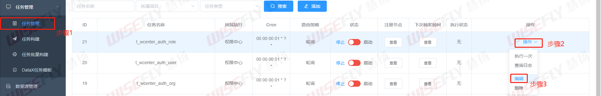
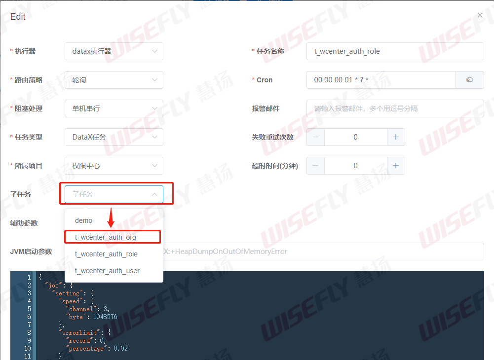
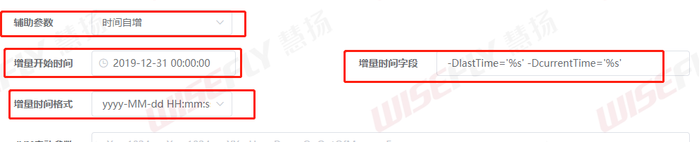
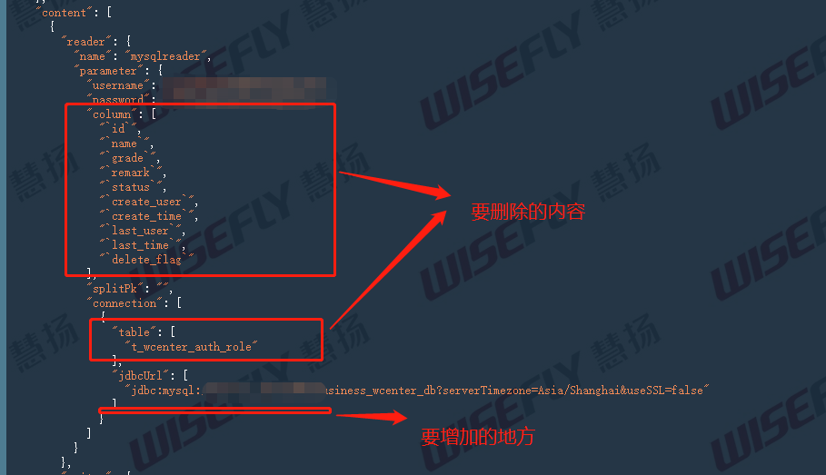
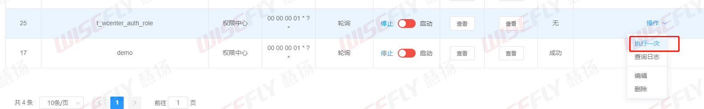
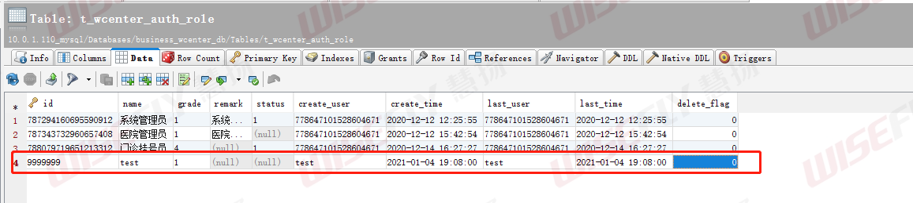

# datax-web增量更新步骤

下面步骤以示例为线索，进行讲述。


## 实现目的

从mysql中的business_wcenter_db数据库中把用户，角色、组织表增量同步到mysql的business_wcenter_db_2库中来。
按照角色、组织、用户的顺序进行同步。
增量同步标志是last_time 

t_wcenter_auth_role：角色表

t_wcenter_auth_org：组织表

t_wcenter_auth_user：用户表

分析：

1. 建备份库和表
2. 新增任务，任务增量更新表
3. 表的备份要按照角色 -> 组织 -> 用户的顺序进行同步


## 建备份库和表

这，太简单了吧，但凡立志成为curd大师的人都应该掌握，省略。


## 前置准备

1. 建立项目。操作步骤：项目管理 -> 添加

2. 添加数据源。操作步骤：数据源管理 -> 添加

3. 增加DataX任务模板。操作步骤：任务管理 -> DataX任务模板 -> 添加

4. 批量构建任务。操作步骤：任务管理 -> 任务批量构建。

   构建Reader部分：选中business_wcenter_db，以及我们需要备份的表

   构建Writer部分：选中business_wcenter_db_2，以及我们的备份表

   表映射部分：**源端表**和**目标表**都全选

   批量创建部分：**选择模板**选择我们创建的DataX任务模板后，点击**批量创建任务**

   **重复上面操作**，直至3张表都建立了任务。

5. 到这里，我们的前置准备就完成了。我们创建的3个任务可以在任务管理 -> 任务管理 看到


## 指定任务执行顺序

datax-web没有为我们提供直接指定任务执行顺序的功能，但是却提供了一个子任务的概念。

子任务：当一个任务执行完成之后，就会触发子任务

通过子任务，我们可以实现表的备份要按照角色 -> 组织 -> 用户的顺序进行同步的功能。


我们首先为角色表任务指定组织表子任务，然后组织表任务指定用户表子任务。这样就可以实现指定任务执行顺序的功能。

以**为角色表任务指定组织表子任务**为例：





这样，我们就完成了指定任务执行顺序的功能。


## 修改任务更新策略为增量备份

以角色任务为例：(其他两个任务照本宣科即可)


### 修改任务配置选项

任务管理 -> 任务管理 可以看到我们之前创建的任务。

编辑任务，并将任务配置选项设置为下图所示：



1. 辅助参数：设置增量备份策略，这里我们使用时间自增。

2. 增量开始时间：这里对应的是**SQL中查询时间的开始时间**。用户使用这个选项方便进行第一次的全量备份。当任务同步一次之后，这里的时间就会更新成上一次任务执行的时间。这里，我们把增量开始时间设置成2019-12-31 00:00:00就是为了进行第一次的全量备份。

3. 增量时间格式：就是数据库中last_time字段的时间格式

4. 增量时间字段：

   先来解释这段字符串：`-DlastTime='%s' -DcurrentTime='%s'`

   ```
   1.-D是DataX参数的标识符，必配
   2.-D后面的lastTime和currentTime是DataX json中where条件的时间字段标识符，必须和json中的变量名称保持一致
   3.='%s'是项目用来去替换时间的占位符，比配并且格式要完全一致
   4.注意-DlastTime='%s'和-DcurrentTime='%s'中间有一个空格，空格必须保留并且是一个空格
   ```


### 修改任务json配置文件

这里提示一下：**一定要认真核对配置文件**

下图展示了reader插件配置需要删除的column和table配置项，同时需要增加内容的地方。

增加内容为：(这里**强烈不推荐使用*号**，这里只是为了方便演示)

```json
"querySql": [
                  "select * from t_wcenter_auth_role where last_time >= ${lastTime} and last_time < ${currentTime}"
                ]
```




修改后的json配置文件如下：

```json
{
  "job": {
    "setting": {
      "speed": {
        "channel": 3,
        "byte": 1048576
      },
      "errorLimit": {
        "record": 0,
        "percentage": 0.02
      }
    },
    "content": [
      {
        "reader": {
          "name": "mysqlreader",
          "parameter": {
            "username": "****************",
            "password": "****************",
            "splitPk": "",
            "connection": [
              {
                "jdbcUrl": [
                  "jdbc:mysql://********/business_wcenter_db?serverTimezone=Asia/Shanghai&useSSL=false"
                ],
                "querySql": [
                  "select * from t_wcenter_auth_role where last_time >= ${lastTime} and last_time < ${currentTime}"
                ]
              }
            ]
          }
        },
        "writer": {
          "name": "mysqlwriter",
          "parameter": {
            "username": "***********",
            "password": "***********",
            "column": [
              "`id`",
              "`name`",
              "`grade`",
              "`remark`",
              "`status`",
              "`create_user`",
              "`create_time`",
              "`last_user`",
              "`last_time`",
              "`delete_flag`"
            ],
            "connection": [
              {
                "table": [
                  "t_wcenter_auth_role"
                ],
                "jdbcUrl": "jdbc:mysql://**********/business_wcenter_db_2?serverTimezone=Asia/Shanghai&useSSL=false"
              }
            ]
          }
        }
      }
    ]
  }
}
```


## 测试

任务管理界面点击角色任务执行一次



查看我们的备份表，我们就会发现数据全量备份成功。


接着，测试增量备份，我们在角色表新增一条数据



接着，我们再点击执行一次，就会发现数据增量备份了。


## 参考资料

[DataX Web数据增量同步配置说明](https://my.oschina.net/u/4259890/blog/4362748)

