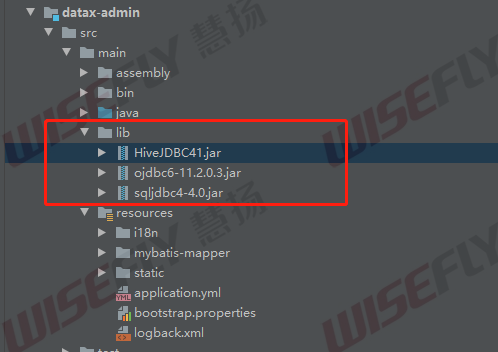
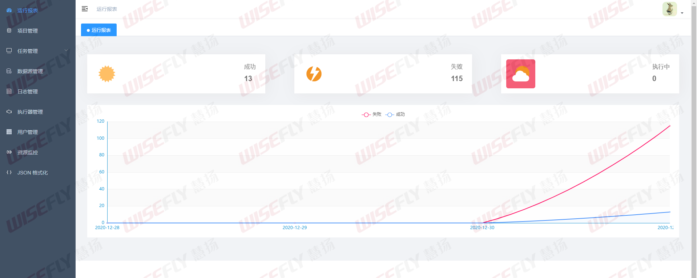
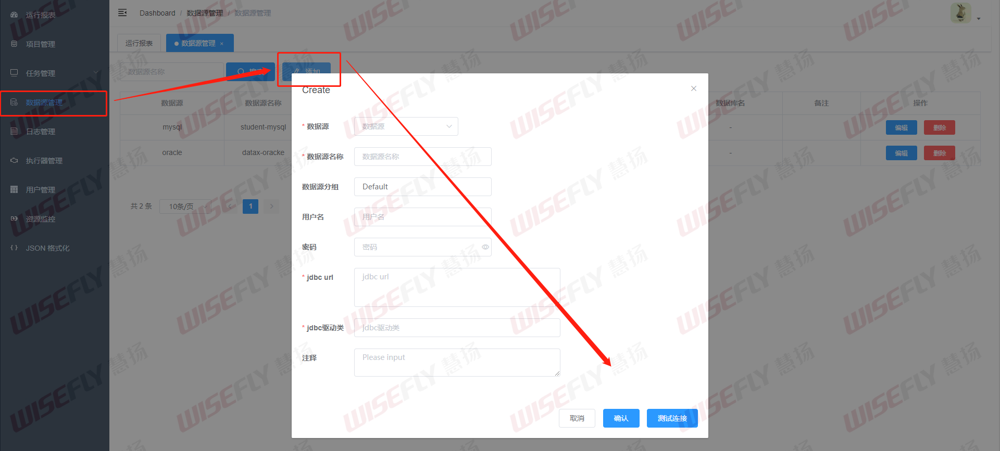
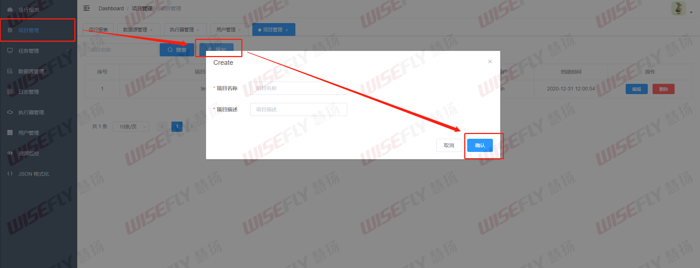
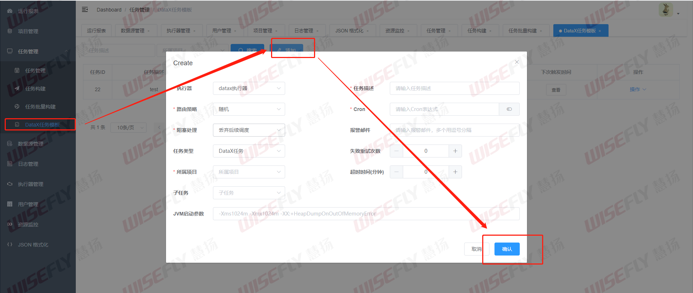
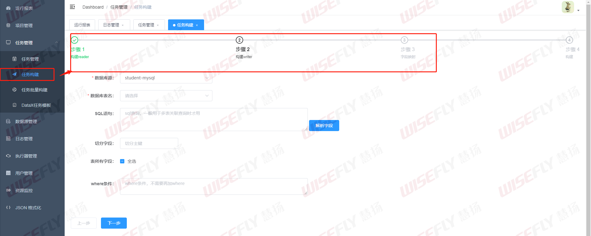
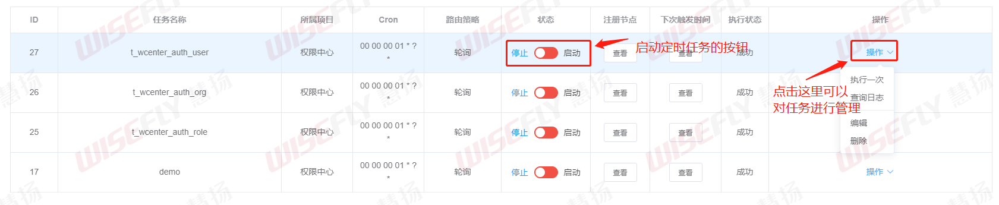
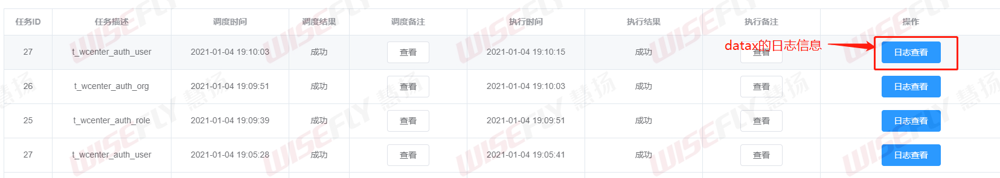

# datax-web简介

[datax-web - github地址](https://github.com/WeiYe-Jing/datax-web)


## 什么是datax-web

DataX本身没有图形可视化界面，DataX Web是在DataX之上开发的分布式数据同步工具，提供可视化界面。用户可以在界面上配置数据源，创建数据同步任务，支持查看数据同步进度及日志。


## datax-web搭建

### 前提准备

1. DataX安装，同时配置环境变量`DATAX_HOME`

2. 下载datax-web项目

3. 创建数据库

   执行bin/db下面的datax_web.sql文件


### 项目配置

1. 修改datax_admin下resources/application.yml文件
2. 修改datax_executor下resources/application.yml文件


### 项目打jar包

1. datax_admin项目打包
2. datax_executor项目打包

之后放到服务器上运行


### 搭建小坑

#### mysql驱动版本切换

datax-web默认是mysql 5.x版本的驱动包

解决方法：切换mysql 8.x依赖包


#### jdk版本问题

会出现找不到本地jdk的tools.jar包，如下


解决方法：

将项目jdk切换成 1.8的版本


#### 生成的jar包没有依赖

使用项目的依赖打jar包，会存在jar包没有依赖的jar包问题

解决方法：

将打包的插件切换成spring-boot-maven-plugin

注释原来打jar包的插件

```xml
<plugin>
    <groupId>org.apache.maven.plugins</groupId>
    <artifactId>maven-jar-plugin</artifactId>
    <configuration>
        <excludes>
            <exclude>**/*.yml</exclude>
            <exclude>**/*.properties</exclude>
            <exclude>**/*.sh</exclude>
            <exclude>**/*.xml</exclude>
        </excludes>
    </configuration>
</plugin>
```

改成spring-boot-maven-plugin

```xml
<plugin>
    <!-- 指定项目编译时的java版本和编码方式 -->
    <groupId>org.springframework.boot</groupId>
    <artifactId>spring-boot-maven-plugin</artifactId>
    <executions>
        <execution>
            <goals>
                <goal>repackage</goal>
                <goal>build-info</goal>
            </goals>
        </execution>
    </executions>
</plugin>
```


#### 项目自带jar包没有打包进来

以datax_admin项目为例：

下面这种在项目lib文件加下的依赖jar包，是不会被打包进jar包的




解决方法：

1. 在pom.xml文件里加入指向本地jar包的依赖

```xml
<!-- 项目外部依赖 /lib下面的依赖 -->
<dependency>
    <groupId>org.apache.hive</groupId>
    <artifactId>HiveJDBC41</artifactId>
    <version>4.1</version>
    <scope>system</scope>
    <systemPath>${project.basedir}/src/main/lib/HiveJDBC41.jar</systemPath>
</dependency>
<dependency>
    <groupId>com.oracle.database.jdbc</groupId>
    <artifactId>ojdbc6</artifactId>
    <version>11.2.0.3</version>
    <scope>system</scope>
    <systemPath>${project.basedir}/src/main/lib/ojdbc6-11.2.0.3.jar</systemPath>
</dependency>
<dependency>
    <groupId>com.microsoft.sqlserver</groupId>
    <artifactId>sqljdbc4</artifactId>
    <version>4.0</version>
    <scope>system</scope>
    <systemPath>${project.basedir}/src/main/lib/sqljdbc4-4.0.jar</systemPath>
</dependency>
```

> 注：这里的groupId、artifactId、version信息都是可以自己指定的

2. 为spring-boot-maven-plugin插件指定打包时加入我们上面指定的jar包

```xml
<plugin>
    <groupId>org.springframework.boot</groupId>
    <artifactId>spring-boot-maven-plugin</artifactId>
    <executions>
        <execution>
            <goals>
                <goal>repackage</goal>
                <goal>build-info</goal>
            </goals>
        </execution>
    </executions>
    <!-- 指定打包时加入我们上面指定的jar包 -->
    <configuration>
        <includeSystemScope>true</includeSystemScope>
    </configuration>
</plugin>
```


#### 不支持python3

datax-web默认支持Python2.7。如果想要支持python3，需要修改替换datax/bin下面的三个python文件，替换文件在doc/datax-web/datax-python3下。


## datax-web使用

### datax-admin启动后打开页面

http://192.168.8.51:18088/index.html




### 任务配置

#### 配置数据源

数据源管理 -> 增加




#### 项目配置

项目管理 -> 添加




#### 配置任务模板

任务管理 -> DataX任务模板




#### 配置任务

任务管理 -> 任务构建




配置完成之后，创建的任务在**任务管理**界面查看。


### 任务执行

创建任务之后，我们可以在任务管理 -> 任务管理界面看到我们所创建的所有任务。



在这个界面，我们可以通过状态列的按钮来开启任务的定时执行。也可以通过操作 -> 执行一次来仅执行任务一次。


### 日志查看

日志管理界面可以看到我们所有任务的执行日志信息。



通过这个界面我们可以看到任务的调度结果，指定结果，执行时间等信息。通过日志查看的蓝色按钮，我们可以查看datax执行job的日志信息，从而查看job的详细信息，也可以方便我们定位任务错误。


## 参考资料

[DataX Web2.0发布，集成定时任务，支持分布式](https://segmentfault.com/a/1190000021310189)

[SpringBoot引入第三方jar包或本地jar包的处理方式](https://www.cnblogs.com/netcorner/p/10962981.html)