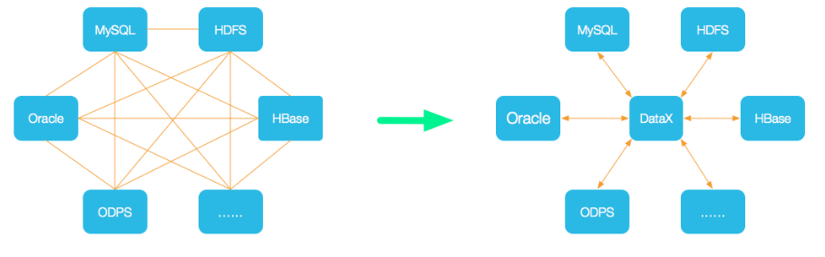
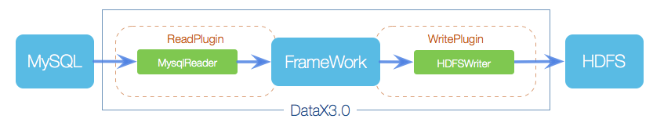
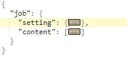
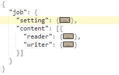
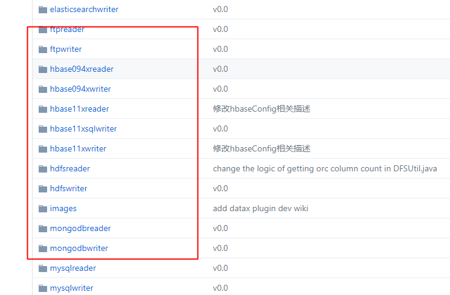

# DataX介绍

[DataX - github地址](https://github.com/alibaba/DataX)


## 什么是DataX

DataX是阿里巴巴集团内被广泛使用的离线**数据同步**工具/平台，实现包括MySQL、Oracle、SqlServer、Postgre、HDFS、Hive等各种异构数据源之间高效的数据同步功能。


## DataX安装

### System Requirements

- Linux
- [JDK(1.8以上，推荐1.8)](http://www.oracle.com/technetwork/cn/java/javase/downloads/index.html)
- [Python(推荐Python2.6.X)](https://www.python.org/downloads/)
- [Apache Maven 3.x](https://maven.apache.org/download.cgi) (Compile DataX)


### Quick Start

1. 下载DataX工具包：[DataX下载地址](http://datax-opensource.oss-cn-hangzhou.aliyuncs.com/datax.tar.gz)

2. 解压到目的文件夹，进入bin目录，即可开始同步作业

3. 开始自检

   ```bash
   python datax.py ../job/job.json
   ```


## DataX概念

### 设计架构



数据交换通过DataX进行中转，任何数据源只要和DataX连接上即可以和已实现的任意数据源同步


### 框架结构



**核心组件：**

Reader：数据采集模块，负责从源采集数据

Writer：数据写入模块，负责写入目标库

Framework：数据传输通道，负责处理数据缓冲等

**以上只需要重写Reader与Writer插件，即可实现新数据源支持。**


## DataX核心架构

DataX 3.0**开源版本**支持**单机多线程**模式完成同步作业运行。


### 核心模块介绍

1. DataX完成单个数据同步的作业，我们称之为job，DataX接受到一个job之后，将启动一个进程来完成整个作业同步过程。DataX Job模块是单个作业的中枢管理节点，承担了数据清理、子任务切分(将单一作业计算转换为多个子Task)、TaskGroup管理等功能
2. DataX Job启动后，会根据不同的源端切分策略，将Job切分多个小的Task(子任务)，以便于并发执行。Task是DataX作业的最小单元，每一个Task都会负责一部分数据的同步工作
3. 切分多个Task之后，DataX Job会调用Scheduler模块，根据配置的并发数据量，将拆分的Task重新组合，组装成TaskGroup(任务组)。每一个TaskGroup负责以一定的并发运行完毕分配好的所有Task，默认单个任务组的并发数量是5。
4. 每一个Task都由TaskGroup复杂启动，Task启动后，会固定启动Reader—>Channel—>Writer的线程来完成任务同步工作
5. DataX作业运行起来之后，Job监控并等待多个TaskGroup模块任务完成，等待所有TaskGroup任务完成后Job成功退出。否则，异常退出，进程退出值非0


### DataX调度流程

举例来说，用户提交了一个DataX作业，并且配置了20个并发，目的是将100张分表的MySQL数据同步到odps里面。DataX的调度决策思想是：

1. DataXJob根据分库分表分成了100个Task
2. 根据20个并发，DataX计算共需要4个TaskGroup
3. 4个TaskGroup平分切分好的100个Task，每一个TaskGroup负责以5个并发共计运行25个Task


## DataX的使用

### 获取配置模板

在DataX安装目录下执行

```bash
python bin/datax.py -r mysqlreader -w hdfswriter
```


### 配置文件

#### 先览

先看官网上一个Mysql Reader的配置文件，配置一个**从Mysql数据库同步抽取数据到本地**的作业

```json
{
    "job": {
        "setting": {
            "speed": {
                 "channel": 3
            },
            "errorLimit": {
                "record": 0,
                "percentage": 0.02
            }
        },
        "content": [
            {
                "reader": {
                    "name": "mysqlreader",
                    "parameter": {
                        "username": "root",
                        "password": "root",
                        "column": [
                            "id",
                            "name"
                        ],
                        "splitPk": "db_id",
                        "connection": [
                            {
                                "table": [
                                    "table"
                                ],
                                "jdbcUrl": [
     "jdbc:mysql://127.0.0.1:3306/database"
                                ]
                            }
                        ]
                    }
                },
               "writer": {
                    "name": "streamwriter",
                    "parameter": {
                        "print":true
                    }
                }
            }
        ]
    }
}
```


#### 分析

整个配置文件是一个Job配置文件，job为根元素，job下面有两个子元素：setting和content

其中，setting描述任务本身的信息，content描述源(reader)和目的端(writer)的信息：



其中，content下又分为reader和writer两块，分别对应源端和目的端：



各reader与writer插件的文档直接点击对应的文件夹进入doc即可！




### 示例

下面这份配置文件的效果是从mysql的student表中读取全部数据，存放到oracle的datax表中。

(注:student和datax表的结构是一样的)

```json
{
    "job": {
        "setting": {
            "speed": {
                 "channel":1
            }
        },
        "content": [
            {
                "reader": {
                    "name": "mysqlreader",
                    "parameter": {
                        "username": "xxx",
                        "password": "xxx",
                        "connection": [
                            {
                                "querySql": [
                                    "select id,name from student;"
                                ],
								"jdbcUrl": [
                                    "jdbc:mysql://host:3308/datax?useUnicode=true&characterEncoding=utf8&useSSL=false"
                                ]
                            }
                        ]
                    }
                },
				"writer": {
                    "name": "oraclewriter",
                    "parameter": {
                        "username": "xxx",
                        "password": "xxx",
                        "column": [
                            "id",
                            "name"
                        ],
                        "preSql": [
                            "delete from datax"
                        ],
                        "connection": [
                            {
                                "jdbcUrl": "jdbc:oracle:thin:@host:1521/hy",
                                "table": [
                                    "DATAX.datax"
                                ]
                            }
                        ]
                    }
                }
            }
        ]
    }
}
```


## 配置详解

### 类型转换

为了规范源端和目的端的类型转换操作，保证数据不失真。DataX支持六种内部数据类型：

- Long：定点数(Int、Short、Long、BigInteger等)
- `Double`：浮点数(Float、Double、BigDecimal(无限精度)等)。
- `String`：字符串类型，底层不限长，使用通用字符集(Unicode)。
- `Date`：日期类型。
- `Bool`：布尔值。
- `Bytes`：二进制，可以存放诸如MP3等非结构化数据。

DataX内部数据类型与对应数据源的数据类型对应表可以在相应的插件文档查看。要注意的是：**DataX不一定支持数据源的所有数据类型。**

> 注：原始真实数据经过计算机或人为原因的改变，导致数据结果与原来的真实数据发生偏差的现象叫失真。数据类型转换错误就会造成数据失真的现象。


### 脏数据问题

DataX的导入过程分为3块逻辑，pre操作，导入操作，post操作。当其中任意一个环节，DataX环节报错。由于DataX不能保证在同一个事务完成上述几个操作，因此可能会存在数据已经落入目的端的情况。

**解决思路：**(两种)

1. 配置pre语句，该语句可以清理当天导入数据，DataX每次导入的时候可以把上次导入失败的数据清理，并重新导入完整数据（第一种）
2. 向临时表导入数据，完成后再rename到线上表


### 增量同步

DataX为大部分的Reader插件提供了**where参数**来完成增量更新，Reader插件根据指定的column、table、where条件拼接成SQL，并使用这个SQL进行数据抽取。

如果我们要同步当天的数据，可以把where条件指定为`gmt_time > $bizdate`。

> $bizdate是阿里的CDP平台或者是DataWorks里定义的系统变量，表示对应的业务时间，业务时间默认为job运行日期的前一天。


然而，真实的业务场景太复杂，where并不足以描述所筛选的条件，用户可以通过**querySql参数**来自定义筛选SQL。要注意的是：配置了这一项之后，DataX系统就会忽略table、column、where配置项，直接使用这一项来对数据进行筛选。

例如，多表join后同步数据：`select a,b from table_a join table_b on table_a.id = table_b.id`


### 错误率过高

DataX提供了errorLimit参数来限制同步工作中错误率限制。当job出错记录数或错误率超出我们设定的值时，DataX会报错。

这个参数是非必选的，但是当我们没有指定的时候，即便job的错误率非常高，最后的任务显示的是成功。因此，**强烈建议指定错误限制**。


## 扩展

### DataX 3.0不支持mysql8.x的解决方案

切换DataX默认的Mysql驱动包

```
[root@localhost libs]# pwd
/opt/datax/plugin/reader/mysqlreader/libs
[root@localhost libs]# ll | grep mysql
-rw-r--r--. 1 62265 users  960372 Nov 24  2017 mysql-connector-java-5.1.34.jar.bak
-rw-r--r--. 1 root  root  2397321 Dec 29 06:55 mysql-connector-java-8.0.21.jar
```


## 参考文章

[【dataX】阿里开源ETL工具——dataX简单上手](https://www.cnblogs.com/jiangbei/p/9430476.html)

[dataX的安装](https://www.cnblogs.com/jiangbei/p/10901201.html)

[初次使用datax,发现datax不支持mysql8.x](https://blog.csdn.net/jason_9527/article/details/100995505)