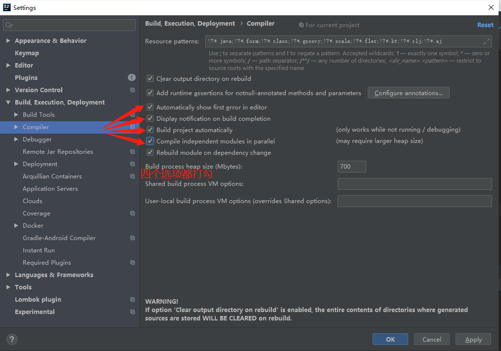
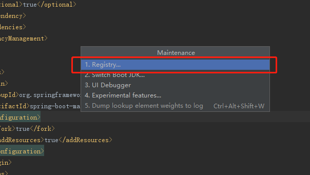
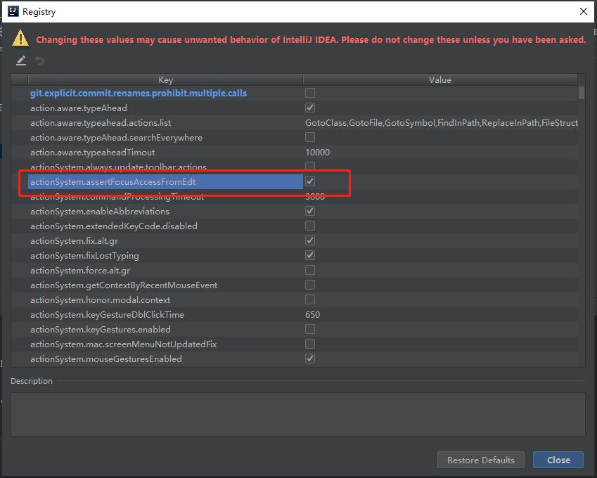
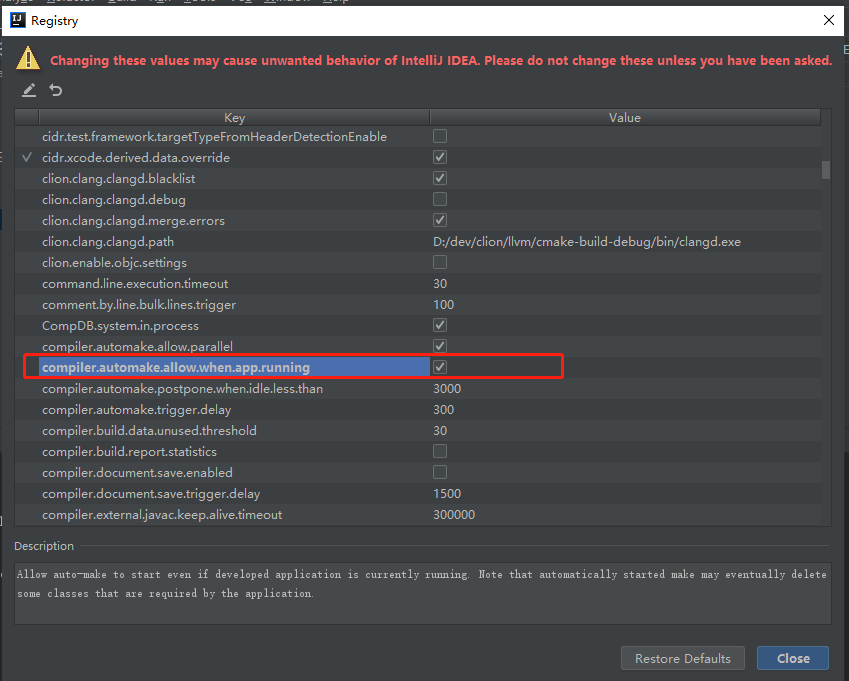
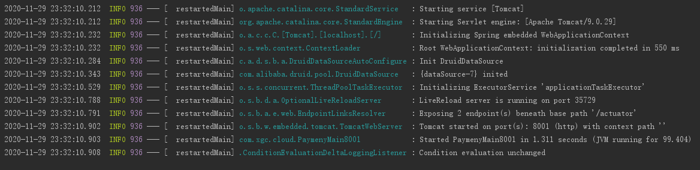

# IDEA SpringBoot热部署

1. 为项目增加下面依赖

   ```xml
   <dependency>
       <groupId>org.springframework.boot</groupId>
       <artifactId>spring-boot-devtools</artifactId>
       <scope>runtime</scope>
       <optional>true</optional>
   </dependency>
   ```

   

2. 为项目增加下面插件

   ```xml
   <plugin>
       <groupId>org.springframework.boot</groupId>
       <artifactId>spring-boot-maven-plugin</artifactId>
       <configuration>
           <fork>true</fork>
           <addResources>true</addResources>
       </configuration>
   </plugin>
   ```

   

3. 在配置的编译器部分勾选下图的四个选项

   

   

4. 同时按下`ctrl + shift + alt + /`，会下图所示界面，点击`Registry`

   

   

5. 之后会出现下图界面，勾选下图红色框住的两个选项，然后点击close按钮

   
   
   

   

6. 重启idea，之后当项目运行的时候，我们修改了代码，项目会自动的重新加载最新代码

   

   