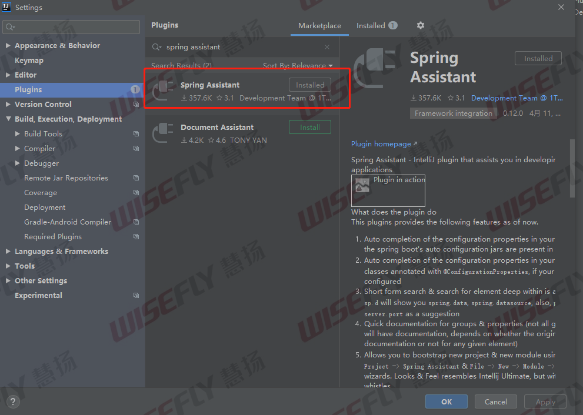
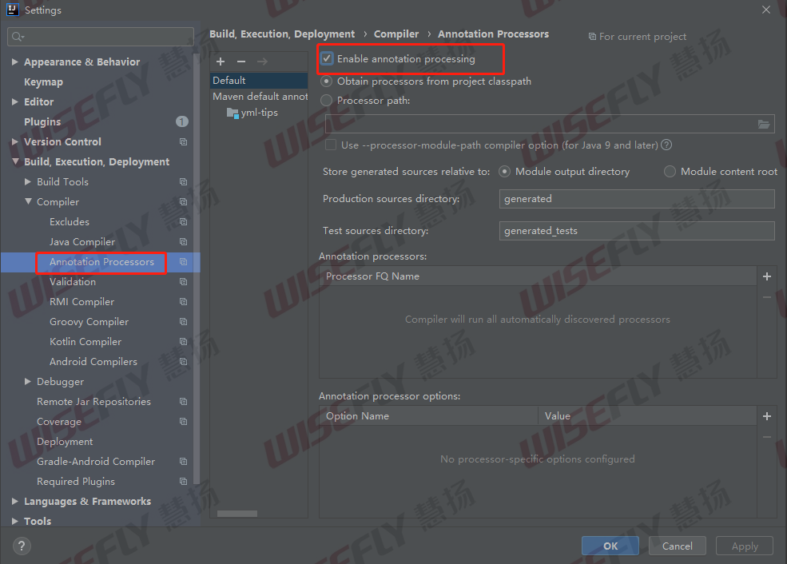

# IDEA社区版实现代码提示

idea社区是不支持配置文件语法提示的，我们可以通过插件Spring Assistant来提供语法提示功能。

## idea安装spring assistant插件

## 提供自定义配置语法提示

上述插件安装完成之后，就支持Spring的语法提示了。

但是想要支持自定义配置的语法提示还需要做如下配置：

`Settings > Build, Execution & Deployment > Compiler > Annotation Processors`的Enable annotation processing`被选中，如下图

