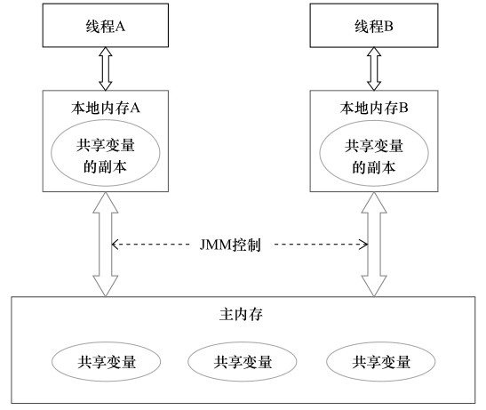
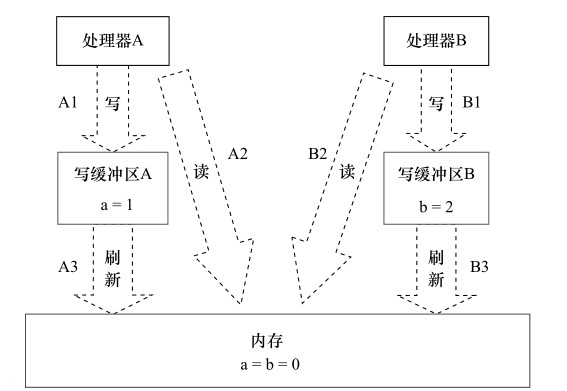
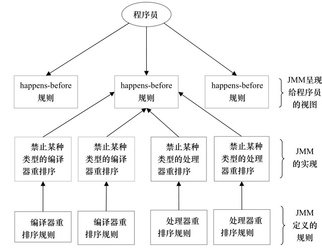
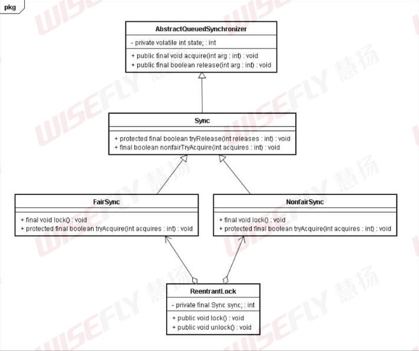

# Java内存模型

## Java内存模型的基础

### 并发编程模型的两个关键问题

在并发编程中，要处理两个关键问题

- 线程之间如何通信
- 线程之间如何同步


**通信是指线程之间以何种机制来交换信息。**在命令式编程中，线程之间的通信机制有两种：**共享内存**和**消息传递**。

在共享内存的并发模型中，线程之间共享程序的公共状态，通过读-写内存中的公共状态来进入隐式通信。

在消息传递的并发模型中，线程之间没有公共状态，线程必须通过发送消息来显式进行通信。


**同步是指程序中用于不同线程间操作发生相对顺序的机制。**

在共享内存的并发模型中，程序员必须显式指定某段代码或某个方法必须在线程间互斥执行，同步是显式进行的。

在消息传递的并发模型中，消息的发送必须在消息的接受之前，同步是隐式进行的。


Java的并发采用的是**共享内存模型**，因此Java线程之间的通信是隐式进行的，整个通信过程对程序员完全透明。如果编写多线程程序的程序员不理解隐式进行的线程之间通信的工作机制，就会遇到各种奇怪的内存可见性问题。


### Java内存模型的抽象结构

在Java中，实例域，静态域和数组元素都存储在堆内存中，堆内存是线程共享的。(下面用共享变量统一指代实例域，静态域和数组元素)

局部变量(Local Variables)、方法定义参数(Formal Method Parameters)和异常处理器参数(Exception Handler Parameters)不会在线程之间共享，不会有内存可见性的问题，也不受内存模型影响。


Java线程之间的通信由Java内存模型(本文简称JMM)来控制，JMM决定了一个线程对共享变量的写入何时对另一个线程可见。

Java内存模型的抽象如图：



从上图来看，线程A要与线程B继续通信，必须经过下面2个步骤：

1. 线程A将本地内存中更新过的共享变量更新到主内存中
2. 线程B到主内存中去读取线程A之前已更新过的共享变量


### 从源代码到指令序列的重排序

在执行程序的时候，为了提高程序性能，编译器和处理器常常会对程序进行指令重排序。重排序有以下三种类型：

1. **编译器优化的重排序。**编译器在不影响单线程程序语义的前提下，重新安排语句的执行顺序。
2. **指令级并行的重排序。**现代处理器采用了指令级并行技术(Instruction-Level Parallelism，ILP)来将多条指令重叠执行。如果不存在数据依赖，处理器可以改变语句对应机器指令的执行顺序。
3. **内存模型的重排序。**由于处理器使用了缓存和读/写缓存区，这使得加载和存储操作看上去好像是乱序执行。


从Java源代码到最终实际执行的指令序列，会分别经历下图3种重排序：


上图的1属于编译器重排序，2和3属于处理器重排序。这些重排序可能会导致多线程程序出现内存可见性问题。

对于编译器，JVM的编译器重排序规则会禁止特定类型的编译器重排序。

对于处理器，JVM的处理器重排序规则会要求Java编译器在生成指令序列时，插入特定类型的内存屏障(Memory Barriers)指令，从而来禁止特定类型的处理器重排序。


JMM属于语言级的内存模型，它确保在不同的编译器和不同的处理器平台上，通过禁止特定类型的编译器重排序和处理器重排序，从而为程序员提供一致的内存可见性保证。


### 并发编程模型的分类

现代处理器使用写缓冲区临时保存向内存写入的数据。写缓存区可以保证指令流水线持续进行，避免由于处理器停顿下来等待向内存写入数据的延迟。同时还以批处理的方式刷新写缓冲区，合并多次对统一内存地址的写操作，减少对内存总线的占用。

但是每个处理器的写缓冲区，仅对它所在的处理器可见。这个特性会对内存操作的顺序产生重要影响：处理器对内存的读/写操作的执行顺序，不一定与内存实际发生的读/写操作顺序一致。


看下图：




这里，处理器A和处理器B同时将共享变量写入到自己的写缓冲区，接着分别从主内存获取b,a的值。然后处理器A和处理器B才将自己的写缓冲区刷新到主内存。这样就导致了数据不一致的问题。

从内存操作实际发生的顺序来看，直到处理器刷新自己的写缓冲区到主内存，写操作才算执行了。处理器A执行内存操作的顺序是：A1→A2,但内存实际发生的顺序是A2→A1。此时处理器A的内存操作顺序被重排序了。


为了保证内存的可见性，Java编译器在生成指令序列的适当位置会插入内存屏障指令来禁止特定类型的处理器重排序。JMM把内存屏障指令分为4类：

| 屏障类型            | 指令示例                 | 说明                                                         |
| ------------------- | ------------------------ | ------------------------------------------------------------ |
| LoadLoad Barriers   | Load1;LoadLoad;Load2     | 确保Load1数据的装载先于Load2及所有后续装载指令的装载         |
| StoreStore Barriers | Store1;StoreStore;Store2 | 确保Store1数据对其他处理器可见(刷新到主内存)先于Store2及后续所有存储指令的存储 |
| LoadStore Barriers  | Load1;LoadStore;Store2   | 确保Load1数据装载先于Store2及所有后续存储指令刷新到内存      |
| StoreLoad Barriers  | Store1;StoreLoad;Load2   | 确保Store1数据对其他处理器可见(刷新到主内存)先于Load2及所有后续装载指令的装载。StoredLoad Barriers会先使该屏障之前的所有内存访问指令(存储和装载指令)完成之后，才执行该屏障之后的内存访问指令 |

StoreLoad Barriers是一个全能型的屏障，包含了其他三个屏障的功能。现代的处理器大多支持这个屏障(其他类型的屏障不一定被所有处理器支持)。执行该屏障开销会很大，因为当前处理器通常要把写缓冲区中的数据全部刷新到内存中(Buffer Fully Flush)。


### happens-before简介

在JMM中，一个操作执行的结果要对另一个操作可见，那么这两个操作必须存在 happens-before关系。这里提到的两个操作可以在一个线程里面，也可以在不同线程里面。

与程序员密切相关的 happens-before规则如下：

- 程序顺序规则：一个线程的每个操作 happens--before于后续的所有操作。
- 监视器锁规则：对一个锁的解锁 happens-before于后续对这个锁的加锁
- volatile变量规则：对volatile域的写 happens-before于任何后续对这个volatile域的读
- 传递性：如果A happens-before于 B，B happens-before于C。那么A happens-before于C。

> **注意：**
>
> 两个操作具有happens-before关系，并不意味着前一个操作必须在后一个操作之前执行。
>  happens-before仅仅要求前一个操作(执行的结果)对后一个操作可见，且前一个操作按顺序排在后一个操作之前。


happens-before与JMM的关系如下图：



如图所示：一个happens-before规则对应一个或多个编译器和处理器重排序规则。


## 重排序

重排序是指编译器和处理器为优化程序性能而对指令序列重新排序的一种手段。


### 数据依赖性

如果两个操作访问同一个变量，且这两个操作中有一个为写操作，此时这两个操作之间就存在**数据依赖性**。

数据依赖分为下面3种类型：

| 名称   | 代码示例       | 说明                           |
| ------ | -------------- | ------------------------------ |
| 写后读 | a=1;<br />b=a; | 写一个变量之后，再读这个变量   |
| 写后写 | a=1;<br />a=2; | 写一个变量之后，再写这个变量   |
| 读后写 | a=b;<br />b=1; | 读取一个变量之后，再写这个变量 |

上面3种情况，只要重排序两个操作的执行顺序，程序的执行结果就会被改变。

编译器和处理器在对操作进行重排序时，会遵循数据依赖性，编译器和处理器不会改变存在数据依赖关系的两个操作的执行顺序。

这里所说的数据依赖性仅针对单个处理器中的指令序列和单个线程中执行的操作，不同处理器之间和不同线程之间的数据依赖性不被编译器和处理器考虑。


### as-if-serial语义

as-if-serial语义的意思是：不管怎么重排序，(单线程)程序的执行结果不能被改变。编译器、runtime和处理器都必须遵循as-if-serial语义。


## 顺序一致性

顺序一致性内存模型是一个理论参考模型，在设计的时候，处理器的内存模型和编程语言的内存模型都会以顺序一致性内存模型作为参照。


### 数据竞争和顺序一致性

Java内存模型规范对数据竞争定义如下：

> 在一个线程写一个变量，在另一个线程读同一个变量，而且读和写没有通过同步来排序。

当代码中存在数据竞争，程序的执行就会出现不合预期的结果。


JMM对正确同步的多线程程序的内存一致性做了如下保证：

> 如果程序是正确同步的，程序的执行将具有顺序一致性(Sequentially Consistent)——即程序的执行结果与该程序在顺序一致性内存模型中执行的结果一致。


### 顺序一致性内存模型

顺序一致性内存模型是一个理想化的模型，为程序员提供了极高的内存可见性保证。

顺序一致性内存模型有两个特点：

1. 一个线程的所有操作安装程序顺序执行
2. 不论程序是否同步，所有线程看到的执行顺序是一致的。在顺序一致性内存模型中，每个操作都是原子执行，而且立即对其他线程可见。


在**概念**上理解顺序一致性内存模型：

顺序一致性内存模型有一个单一的全局内存，在同一时刻只能有一个线程访问全局内存，同时每个线程都按照程序顺序执行操作。这样，就把线程的读写串行化了。


## volatile的内存语义

### volatile的两大特性

- 可见性：一个volatile变量的读，总是能看到最后一个对这个volatile变量的写操作
- 原子性：任何单个volatile变量的读写具有原子性，但类似volatile++的复合操作不具有原子性


### volatile读写的内存语义

- volatile写的内存语义：

  对一个volatile变量的写，JMM会把这个线程的本地内存的共享变量值刷新到主内存

- volatile读的内存语义：

  对一个volatile变量的读，会废弃本地内存的共享变量值，从主内存中获取最新的共享变量值


## 锁的内存语义

### 锁的释放和锁的获取的内存语义

- 锁的释放的内存语义

  JMM会把这个线程的本地内存的共享变量值刷新到主内存

- 锁的获取的内存语义

  JMM会把当前线程的本地内存的共享变量值置为无效，从而使得被监视器保护的临界区代码必须从主内存中读取共享变量

从这里我们可以看到，锁的释放和volatile写的内存语义相同，锁的获取和volatile读的内存语义相同。


### 锁的内存语义实现

这里以ReentranceLock的源代码，来分析锁内存语义的具体实现机制

先看下面示例代码

```java
class ReentranceLockExample {
    int a = 0;
    ReentranceLock lock = new ReentranceLock();
    
    public void writer() {
        lock.lock();
        try {
            a++;
        } finally {
            lock.unlock();
        }
    }
    
    public void reader() {
        lock.lock();
        try {
            int i = a;
            ...
        } finally {
            lock.unlock();
        }
    }
}
```

ReentranceLock的实现依赖于Java同步器框架AbstractQueuedSynchronizer(这里简称AQS)。

AQS使用一个整型的volatile变量state来维护同步状态，这个volatile变量是ReentranceLock内存语义实现的关键。


ReentranceLock类图(部分)




ReentranceLock分为公平锁和非公平锁，我们先分析公平锁：

使用公平锁时，加锁调用轨迹如下：

1. ReentranceLock:lock()
2. FairSync:lock
3. AbstractQueuedSynchronizer:acquire(int arg)
4. ReentranceLock:tryAcquire(int acquires)

第四步开始真正加锁，该方法源码：

```java
protected final boolean tryAcquire(int acquires) {
    final Thread current = Thread.currentThread();
    int c = getState();
    // 获取锁的开始，首先读volatile变量state
    if (c == 0) {        
        if (isFirst(current) && compareAndSetState(0, acquires)) {
            setExclusiveOwnerThread(current);
            return true;
        }
    }
    else if (current == getExclusiveOwnerThread()) {
        int nextc = c + acquires;
        if (nextc < 0)
            throw new Error("Maximum lock count exceeded");
        setState(nextc);
        return true;
    }
    return false;
}
```

从上面源代码，我们可以看出加锁方法首先读取volatile变量state


使用公平锁时，解锁方法unlock()调用轨迹如下：

1. ReentranceLock:unlock()
2. AbstractQueuedSynchronizer:release(int arg)
3. Sync:tryRelease(int releases)

第三步开始真正释放锁，下面是源代码

```java
protected final boolean tryRelease(int releases) {
    int c = getState() - releases;
    if (Thread.currentThread() != getExclusiveOwnerThread())
        throw new IllegalMonitorStateException();
    boolean free = false;
    if (c == 0) {
        free = true;
        setExclusiveOwnerThread(null);
        
       }
    setState(c);// 释放锁的最后，写volatile变量state
    return free;
}
```

从上面的源代码可以看出，在释放锁的最后写volatile变量state。


这里总结一下，**获取锁时先读volatile变量，释放锁的最后写这个volatile变量**。


现在来分析非公平锁内存语义的实现。非公平锁的释放和公平锁完全一样，这样来分析非公平锁的获取：

加锁lock()的调用轨迹如下：

1. ReentranceLock:lock()
2. NonfairSync:lock()
3. AbstractQueuedSynchronizer:compareAndSetState(int expect, int update)

第三步是真正开始加锁，下面是这个方法的源代码：

```java
protected final boolean compareAndSetState(int expect, int update) {
    return unsafe.compareAndSwapInt(this, stateOffset, expect, update);
}
```

这个方法以原子操作的方式更新state变量。


现在对公平锁和非公平锁的内存语义做个总结：

- 公平锁和非公平锁释放时，最后都要写一个volatile变量state。
- 公平锁获取时，首先会去读volatile变量。
- 非公平锁获取时，首先会用CAS更新volatile变量，这个操作同时具有volatile读和volatile写的内存语义。

可以看出锁释放-获取的内存语义有两种实现方式

1. 利用volatile变量的读写的内存语义
2. 利用CAS所附带的volatile读和volatile写的内存语义


