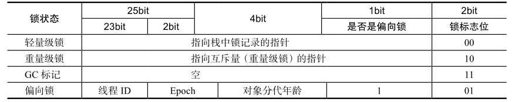
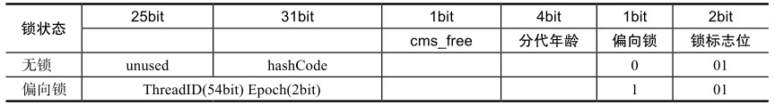

# Java并发机制的底层实现原理

## volatile的应用

volatile是轻量级的synchronized。它可以保证共享变量的可见性。可见性的意思是：一个线程修改了共享变量的值，另一线程能够看到改变后的值。

volatile关键字使用恰当的话，会比synchronized的使用和执行成本更低。这是因为它不会引起线程上下文的切换和调度。

本文通过深入分析硬件层面上，Intel处理器如何实现volatile，来帮助我们理解使用volatile关键字。


### volatile的定义与实现原理

volatile的定义：Java编程语言允许线程访问共享变量，为了确保共享变量能被准确和一致地更新，线程应该确保通过排他锁单独获得这个变量。


在了解volatile的实现原理之前，我们先来了解与其实现原理相关的CPU术语与说明：

| 术语       | 英文单词               | 术语描述                                                     |
| ---------- | ---------------------- | ------------------------------------------------------------ |
| 内存屏障   | memory barries         | 是一组处理器指令，用来实现对内存操作的顺序限制               |
| 缓冲行     | cache line             | 缓存中可以分配的最小存储单位。处理器填写缓存线时会加载整个缓存线，需要使用多个主内存读周期 |
| 原子操作   | atomic operations      | 不可中断的一个或一系列操作                                   |
| 缓存行填充 | cache line fill        | 当处理器识别到从内存中读取操作数是可缓存的，处理器读取整个缓存行到适当的缓存(L1，L2，L3的或所有) |
| 缓存命中   | cache hit              | 如果进行高速缓存行填充操作的内存地址仍然是下次处理器访问的地址时，处理器从缓存中读取操作数，而不是从内存读取 |
| 写命中     | write hit              | 当处理器将操作数写回到一个内存缓存的区域时，它首先会检查这个缓存的内存地址是否在缓存行中，如果存在一个有效的缓存行，则处理器将操这个操作数写回缓存行，而不是内存，这个操作叫做写命中 |
| 写缺失     | write misses the cache | 一个有效的缓存行被写入到不存在的内存区域                     |


volatile是如何来保证可见性的呢？

让我们通过X86处理器下通过工具获取JIT编译器生成的汇编指令来查看对volatile进行写操作时，CPU会做什么事情。

Java代码如下：

```java
instance = new Singleton(); //instance是volatile变量
```

转变成汇编代码，如下：

```
0x01a3de1d: movb $0×0,0×1104800(%esi);
0x01a3de24: lock addl $0×0,(%esp);
```

有volatile变量修饰的共享变量进行写操作的时候会多出第二行汇编代码，通过查IA-32架构软件开发者手册可知，Lock前缀的指令在多核处理器下会触发两件事情：

- 将当前处理器缓存行的数据写回到系统内存
- 这个写回内存的操作会使在其他CPU里缓存了该内存地址的数据无效

这样，处理器对这个数据进行修改操作的时候，就会重新从系统内存中把数据读到处理器缓存里。从而保证了共享变量的可见性。


## synchronized的实现原理与应用

当一个线程访问一个同步代码块，它必须先获得锁，退出和抛出异常时必须释放锁。

**那么锁到底存在哪里？锁里存储了什么信息？**

在JVM规范可以看到Synchronized的实现原理，JVM基于进入和退出Monitor对象来实现方法同步和代码块同步，但两者的实现原理不一样。方法同步通过`monitorenter`和`monitorexit`指令实现的，而代码块同步是使用另一种方法实现的。但是，代码块同步也可以使用这两个指令实现。

`monitorenter`指令是在编译后插入到同步代码块开始部分，`monitorexit`指令是插入到方法结束和异常处，JVM要保证每个`monitorenter`都有一个`monitorexit`与之对应。每个对象都有一个`monitor`对象与之关联，当monitor被持有后，对象被锁定。

当线程运行到`monitorenter`指令，会尝试获取对象的monitor的持有权，即获取锁。


### Java对象头

**synchronized用的锁是存在Java对象头里的。**

如果对象是数组类型，则虚拟机用3个字宽(word)存储对象头。如果对象是非数组类型，则用2字宽存储对象头。

在32位虚拟机中，1字宽等于4个字节，即32bit。对象头各组成部分长度如下：

| 长度     | 内容                   | 说明                           |
| -------- | ---------------------- | ------------------------------ |
| 32/64bit | Mark Word              | 存储对象的hashCode或锁信息等   |
| 32/64bit | Class Metadata Address | 存储到对象类型数据的指针       |
| 32/32bit | Array Length           | 数组的长度(如果当前对象是数组) |


Java对象头的Mark Word里默认存储对象的hashCode，分代年龄和锁标记位。32位JVM里的Mark Word的默认存储结构如下：

| 锁状态   | 25bit          | 4bit         | 1bit 是否是偏向锁 | 2bit 锁标志位 |
| -------- | -------------- | ------------ | ----------------- | ------------- |
| 无锁状态 | 对象的hashCode | 对象分代年龄 | 0                 | 01            |

在运行期间，Mark Word里存储的数据会随着锁标志位的改变而改变。Mark Word可能会变化为存储以下4种数据：



在64位虚拟机下，Mark Word是64bit大小的，其存储结构如下：




### 锁的升级与对比

java1.6为了减少获得锁和释放锁带来的性能开销，引入了偏向锁和轻量锁。

在java1.6中，锁一共有4种状态，级别从低到高是：无锁状态、偏向锁状态、轻量级锁状态和重量级锁。这几个状态会随着竞争情况逐渐升级，但锁可以升级而不能降级，这是为了提高获得锁和释放锁的效率。


#### 偏向锁

HotSpot的作者发现，**大多数情况下，锁不仅不存在多线程竞争，而且还总是由同一个线程多次获得**，为了让线程获得锁的代价降低引入了偏向锁。

当一个线程访问同步块并获得锁的时候，会在对象头和栈帧中的锁记录里存储锁偏向的线程ID，以后该线程在进入和退出代码块的时候不需要进行CAS操作来加锁和解锁，只需要测试一下对象头的Mark Word里是否存储着指向当前线程的偏向锁。


##### 偏向锁的获取

当线程执行到同步块，尝试获取锁：

```
1.先查看对象头的Mark Word里是否存在当前线程的id
	1.1 如果存在，表示当前线程已经获取到了偏向锁
	1.2 如果不存在，执行步骤2
2.查看Mark Word中偏向锁的标记是否为1(表示当前是偏向锁)
	1.1 不为1，则使用CAS竞争锁
	1.2 为1，则尝试使用CAS将当前对象头的偏向锁指向当前线程。
		1.2.1 成功，表示线程获取到了偏向锁
		1.2.2 失败，表示存在竞争，进行偏向锁的撤销
```


##### 偏向锁的撤销

偏向锁使用了一种等到竞争出现才释放锁的机制。

当有两个线程同时竞争同一个偏向锁的时候，如下图所示：


上图的线程1演示了偏向锁初始化的流程，线程2演示了偏向锁撤销的流程。


线程1获取偏向锁的步骤上面已经讲解过了，下面来介绍偏向锁撤销的流程(从线程2尝试获取锁开始，此时线程1持有偏向锁)：

1. 判断对象头的Mark Word是否存在当前线程的id，否(此时存在的线程1的id)
2. 查看Mark Word中的偏向锁标记是否为1，是。
3. 线程2尝试使用CAS来将对象头的偏向锁指向当前线程，失败(此时线程1还存活)，进行**偏向锁的撤销**
4. 等待**全局安全点**(在这个时间点上没有正在执行的字节码)。
5. 暂停拥有偏向锁的线程(线程1)，然后检查这个线程是否存活。如果线程不处于活动状态，则将对象头设置成无锁状态。如果线程存活，栈中的锁记录和对象头的Mark Word要么重新偏向于其他线程，要么恢复到无锁状态，或者标志对象不适合作为偏向锁
6. 唤醒暂停的线程


**注：**

1. 步骤5中，线程存活，那么栈中的锁记录和对象头的Mark Word会变成三种状态之一。这是通过判断对象Mark Word中的Epoch值。若该值大于40直接升级为轻量级锁，不论线程1是否继续竞争锁。

   > 偏向锁头部Epoch字段值：表示该对象偏向锁的撤销次数，默认撤销次数40次以上，表示此对象不再适合于偏向锁，当下次线程再次获取此对象时，直接变为轻量级锁


##### 关闭偏向锁

偏向锁在Java6和Java7里默认是启用的，但是它在应用程序启动几秒钟之后才激活。

可以使用JVM参数来关闭延迟：`-XX:BiasedLockingStartupDelay=0`

如果确定应用程序中所有的锁通常情况下都处于竞争的状态，可以通过JVM参数关闭偏向锁：`-XX:-UseBiasedLocking=false`，那么程序默认就会进入轻量级锁状态


#### 轻量级锁

##### 轻量级锁加锁

1. 线程在执行同步块之前，JVM会先在当前线程的栈帧中创建用于存储锁记录的空间
2. 将对象头的Mark Word复制到锁记录中，官方称之为Displaced Mark Word
3. 然后线程尝试使用CAS将对象头的Mark Word替换为指向锁记录的指针。如果成功，表示当前线程获得锁。如果失败，表示其他线程竞争锁，当前线程便尝试使用自旋来获取锁。


##### 轻量级锁解锁

轻量级解锁时，会使用原子的CAS操作将Displaced Mark Word替回到对象头中。如果成功，则表示没有竞争发生。如果失败，表示当前锁存在竞争，锁就会膨胀成重量级锁。

下图是两个线程同时争夺锁，导致锁膨胀的流程图：


因为自旋会消耗CPU，为了避免无用的自旋(比如获得锁的线程被阻塞住了)，一旦锁升级成重量级锁，就不能恢复到轻量级锁。当锁处于这种状态下，其他线程试图获取锁，会被阻塞。当持有锁的线程释放锁，就会唤醒这些线程，被唤醒的线程就会开启下一轮的夺锁之争。


#### 锁的优缺点对比

| 锁       | 优点                                                         | 缺点                                         | 适用场景                           |
| -------- | ------------------------------------------------------------ | -------------------------------------------- | ---------------------------------- |
| 偏向锁   | 加速和解锁不需要额外的消耗，和执行非同步方法相比仅存在纳秒级的差距 | 存在线程竞争时，会带来额外的偏向锁撤销的开销 | 适用于仅有一个线程访问同步块场景   |
| 轻量级锁 | 竞争的线程不会阻塞，提高了程序的响应速度                     | 如果始终得不到锁的线程，会自旋，消耗CPU      | 追求响应速度，同步块执行速度非常快 |
| 重量级锁 | 线程竞争不会使用自旋，不会使用CPU                            | 等待锁的线程会阻塞，响应速度慢               | 追求吞吐量，同步块执行时间较长     |


## 原子操作的实现原理

原子操作(atomic operation)，意为“不可中断的一个或一系列操作”。这在多处理器上实现原子操作就变得有点复杂。

下面介绍在Intel处理器和Java里是如何实现原子操作的。


### 术语定义

在了解原子操作的实现原理前，先了解一下相关的术语

| 术语名称     | 英文                   | 解释                                                         |
| ------------ | ---------------------- | ------------------------------------------------------------ |
| 缓存行       | Cache line             | 缓存的最小操作单位                                           |
| 比较并交换   | Compare and Swap       | CAS操作要先输入两个值，一个旧值(期望操作前的值)，一个新值。在操作前先比较旧值是否有变化，如果有变化则不交换；如果无变化，则将旧值换成新值。 |
| CPU流水线    | CPU pipeline           | CPU流程线的工作方式就像工厂生产的流水线，在CPU中由5~6个不同功能的电路单元组成一条**指令处理流水线**。然后将一条X86指令分为5~6步后再由这些电路单元分别执行，这样就能实现在一个CPU时钟周期完成一条指令，因此提高CPU的运算速度。 |
| 内存顺序冲突 | Memory order violation | 内存顺序冲突一般是由假共享引起的，**假共享**是指多个CPU同时修改同一个缓存行的不同部分而引起其中一个CPU的操作无效。当这个内存顺序冲突出现，CPU必须清空流水线。 |


### 处理器如何实现原子操作

处理器能够保证基本的内存操作的原子性。比如：一个处理器在读取一个字节时，其他处理器不能访问这个字节的内存地址。但是，对于复杂内存操作是无法自动保证原子性的，比如跨总线宽度、跨多个缓存行和跨页表的访问。

但是，处理器提供了总线锁定和缓存锁定两个机制来保证复杂内存操作的原子性。


#### 使用总线锁保证原子性

多个处理器对共享变量进行读写，会导致实际数值与期望数值不一致。如：变量i=1，两个线程同时进行i++，可能会导致实际数值是2，而不是3。

这是因为多个处理器同时从自己的缓存中读取变量i，然后再进行自增操作，然后再写入系统内存。

可以使用总线锁解决这个问题。

**总线锁**就是使用处理器提供的一个LOCK#信号，当一个处理器在总线上输出此信号时，其他处理器的请求将被阻塞，这样该处理器就可以独占共享内存。


#### 使用缓存锁保证原子性

在同一时刻，我们只需保证对某个内存单元的操作是原子性就可以了。使用总线锁将CPU和内存之间的通信锁住，这使得其他处理器不能操作其他内存地址的数据，所以总线锁的开销比较大。

可以使用**缓存锁定**来实现复杂内存操作的原子性。所谓**缓存锁定就是某块CPU对缓存中的数据进行操作后，就通知缓存这个数据的其他CPU放弃缓存的数据，或者重新从内存读取。**

但有两种情况处理器不会使用缓存锁定：

1. 当操作的数据不能缓存在处理器，或操作的数据跨多个缓存行时，处理器使用总线锁定
2. 处理器不支持缓存锁定


### Java如何实现原子操作

在Java中可以通过**锁**和**循环CAS**的方式来实现原子操作


#### 使用循环CAS实现原子操作

自旋CAS实现的基本思路是：循环使用CAS操作直至成功为止。

下面代码实现了基于CAS线程安全的计数器方法safeCount和一个非线程安全的计数器count：

```java
public class Counter {

  private AtomicInteger atomicI = new AtomicInteger();
  private int i = 0;

  public static void main(String[] args) {

    final Counter cas = new Counter();
    List<Thread> threadList = new ArrayList<Thread>(600);
    long start = System.currentTimeMillis();
    for (int j = 0; j < 100; j++) {
      Thread t = new Thread(new Runnable() {
        public void run() {
          for (int i=0; i<10000; i++) {
            cas.count();
            cas.safeCount();
          }
        }
      });
      threadList.add(t);
    }

    for (Thread t: threadList) {
      t.start();
    }

    //等待所有线程执行完成
    for (Thread t : threadList) {
      try {
        t.join();
      } catch (InterruptedException e) {
        e.printStackTrace();
      }
    }

    System.out.println(cas.i);
    System.out.println(cas.atomicI.get());
    System.out.println(System.currentTimeMillis() - start);

  }

  /**
   * 使用CAS实现线程安全计数器
   */
  private void safeCount() {
    for (;;) {
      int i = atomicI.get();
      boolean suc = atomicI.compareAndSet(i, ++i);
      if (suc) {
        break;
      }
    }
  }

  /**
   * 非线程安全计数器
   */
  private void count() {
    i++;
  }

}
```


#### CAS实现原子操作的三大问题

CAS虽然很高效的解决了原子操作，但是存在三大问题：ABA问题，循环时间长开销大，以及只能保证一个共享变量的原子操作。

1. **ABA问题。**CAS在操作值之前需要先检查值有没变化，没有就更新。但是如果一个值原来是A，变成了B，又变成了A，那么使用CAS进行检查时是认为没有发生变化，这就是ABA问题。解决这个问题的方法是在变量前面追加上版本号，每次变量更新的时候，会把版本号加1，这样`A → B →A`就会变成`1A→2B→3A`。
   从JDK1.5开始，JDK的Atomic包提供了一个类`AtomicStampedReference`来解决ABA问题。这个类的compareAndSet方法的作用是首先检查当前引用是否等于预期引用，并且检查当前标志是否等于预期标志，如果全部相等，则以原子方式将该引用和该标志的值设置为给定的更新值。

   ```java
   public boolean compareAndSet(
   	V	execeptedReference, //预期引用
       V	newReference, //更新后的引用
       int expectedStamp, //预期标志
       int newStamp //更新后的标志
   )
   ```

2. **循环时间长**。自旋CAS如果长期不成功，会给CPU带来很大的执行开销。如果JVM能够支持处理器提供的pause指令，那么效率会有一定提升。pause的指令有两个作用：

   - 延迟流水线执行指令(de-pipeline)，使CPU不会消耗过多的执行资源，延迟的时间取决于具体实现的版本，在一些处理器上延迟时间是零
   - 避免在退出循环的时候因内存顺序冲突(Memory Order Violation)而引起CPU流水线被清空(CPU Pipeline Flush)，从而提高CPU的执行效率

3. **只能保证一个共享变量的原子操作**。当对一个共享变量执行操作时，我们可以使用循环CAS的方式来保证原子操作。但对多个共享变量操作时，循环CAS就无法保证原子的操作性，这个时候就可以用锁。还有一个取巧的办法，就是把多个共享变量合并成一个共享变量来操作。比如：有两个共享变量i=2，j=a，合并一下 ij=2a，然后使用CAS来操作ij。

   从JDK1.5开始，JDK提供了AtomicReference类来保证引用对象之间的原子性，就可以把多个变量放在一个对象里来进行CAS操作。


#### 使用锁机制实现原子操作

锁机制保证了只有获得锁的线程才能操作锁定的内存区域。JVM内部实现了很多锁机制，有偏向锁，轻量级锁，互斥锁。有意思的是，除了偏向锁，JVM实现锁的方式都用了循环CAS，即一个线程想进入同步块必须使用循环CAS来获取锁，想退出同步块时循环CAS来释放锁。


