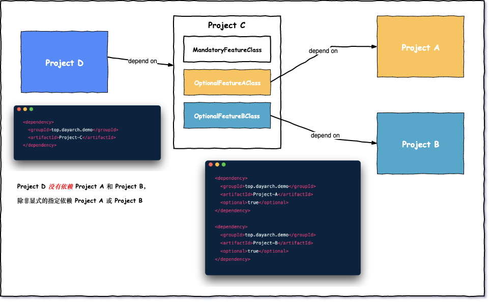
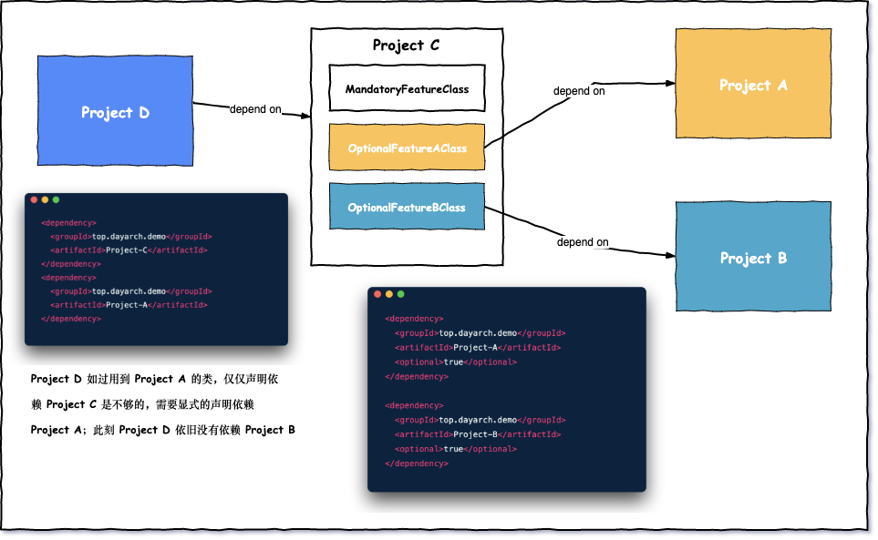
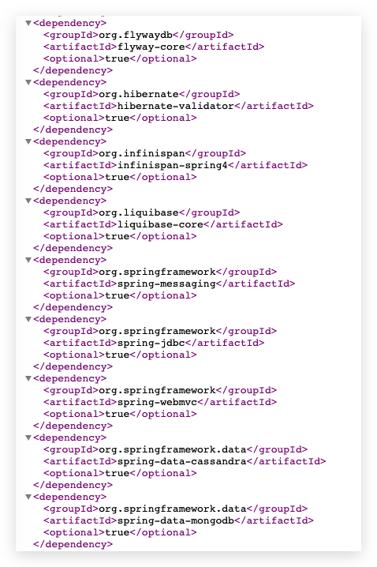

# Maven optional标签

> 转载自：[Maven optional关键字透彻图解 - 日拱一兵 - 博客园 (cnblogs.com)](https://www.cnblogs.com/FraserYu/p/11796301.html)


## 前言

在Maven pom.xml中，你经常会看到依赖项中有类似下面的代码

```xml
<dependency>
  <groupId>sample.ProjectA</groupId>
  <artifactId>Project-A</artifactId>
  <version>1.0</version>
  <scope>compile</scope>
  <optional>true</optional> 
</dependency>
```

那么这个`<optional>true</optional> `是什么意思呢？


## optional标签的作用



Project C使用到了两个来自Project A的类(OptionalFeatureAClass)和Project A的类(OptionalFeatureBClass)。如果Project C没有依赖这两个类，那么编译就会失败。

Project D依赖Project C，但是对于Project D来说，类(OptionalFeatureAClass) 和类 (OptionalFeatureBClass)是**可选的特性**，所以为了让最终的war包不包含不必要的依赖，使用`<optional>`标签声明当前依赖是可选的，这样默认情况下不会被其他项目继承。

如果Project D确实需要Project C中的OptionalFeatureAClass怎么办？我们可以在Project D的pom.xml文件中显示添加声明Project A依赖，继续看下图:



Project D 需要用到 Project A 的 OptionalFeatureAClass，那么需要在 Project D 的 pom.xml 文件中显式的添加对 Project A 的依赖。


## 实际案例

在 [spring-boot-actuator](https://repo1.maven.org/maven2/org/springframework/boot/spring-boot-actuator/1.3.3.RELEASE/spring-boot-actuator-1.3.3.RELEASE.pom) pom.xml 文件中，有超过 20 个依赖是 optional



因为spring boot不可能将没必要的依赖包也打包到你最终的jar包中，所以spring boot actuator的项目最终生成的jar包不会包含这20多个依赖。如果你需要哪一个，就显式声明到自己的项目就可以了。