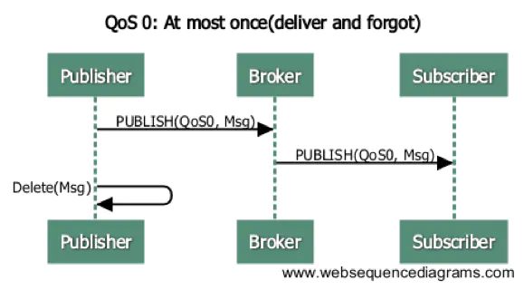
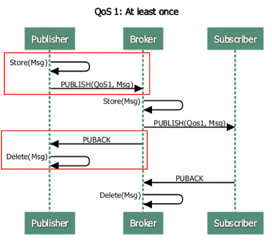
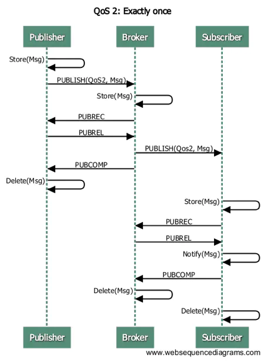

# mqtt-Qos深度解读

## 含义

Quality of Service，服务质量

## 等级和作用

level 0：最多一次的传输，不保证消息一定送达

level 1：至少一次的传输，保证消息一定送达，但可能重复

level 2：只有一次的传输，保证消息一定送达，而且只会收到一次

## 交互过程

### qos0

对于publisher来说，仅发送一次publish包。对于Broker来说，也是仅发送一次publish包。

### qos1

相对于qos0而言，这个交互多了一次ack的交互。这种模式存在的问题就是，当publisher没有收到service的puback或者 service没有收到Subscriber的puback，那么就会一直发送publish包。这就会导致Subscriber收到多次重复的消息。

需要注意的是，publisher和broker必须保存msg，这样才能重发。出现超时和socket断开等异常情况，才会重发。

### qos2

publisher和broker对消息进行了缓存，其中publisher存储了message和msgID，而broker缓存了msgID，两方都做记录可以保证消息不重复。但是缓存是需要删除的，所以也会存在一定的开销。

## 参考资料

[Mqtt Qos 深度解读](https://www.jianshu.com/p/8b0291e8ee02)