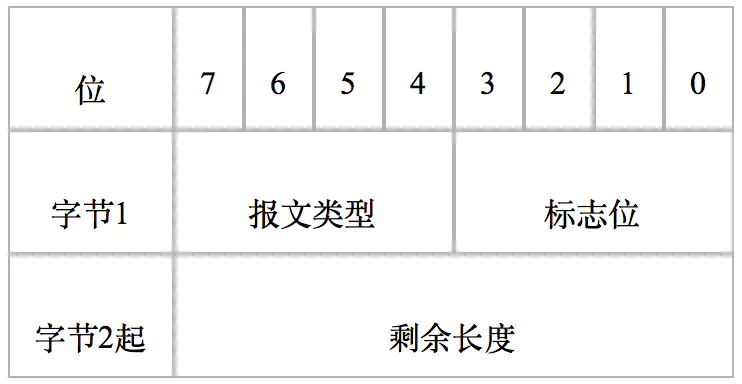

# MQTT协议

## MQTT协议原理

### mqtt协议实现方式

实现MQTT需要客户端和服务器端通讯完成。在通讯过程中，MQTT协议中有3种身份：发布者(Publish)、代理(Broker、服务器)、订阅者(Subscribe)。其中，消息的发布者和订阅者都是客户端，消息代理是服务器，消息发布者可以同时是订阅者。

MQTT传输的消息分为：主题(topic)和负载(payload)两部分

1. topic，可以理解为消息的类型，订阅者订阅后，就会收到该主题的消息内容(payload)
2. payload，可以理解为消息的内容，是指订阅者具体要使用的内容

### 网络传输与应用消息

MQTT会构建底层网络传输：它将建立客户端到服务器的连接，提供两者之间的一个有序的、无损的、基于字节流的双向传输。

当应用数据通过MQTT网络发送时，MQTT会把与之相关的服务质量(QoS)和主题名(Topic)相关联。

### MQTT客户端

一个使用MQTT协议的应用程序或设备，它总是建立到服务器的网络连接。客户端可以：

1. 发布其他客户端可能会订阅的消息
2. 订阅其他客户端发布的消息
3. 退订或删除应用程序的消息
4. 断开与服务器的连接

### MQTT服务器

MQTT服务器被称为消息代理(Broker)，可以是一个应用程序或一台设备。它位于订阅者和发布者之间，它可以：

1. 接受来自客户端的网络连接
2. 接受客户端发布的应用信息
3. 处理来自客户端的订阅和退订请求
4. 向订阅的客户端转发应用程序消息

### MQTT协议中的订阅、主题、会话

#### 订阅(Subscription)

订阅包括主题筛选器(Topic Filter)和最大服务质量(QoS)。订阅会与一个会话(Session)关联。一个会话可以包含多个订阅。每个会话中的每个订阅都有一个不同的主题筛选器。

#### 会话(Session)

每个客户端与服务器建立连接后就是一个会话，客户端和服务器之间有状态交互。会话存在于一个网络之间，也可能在客户端和服务器之间跨越多个连续的网络连接。

#### 主题名(Topic Name)

连接到一个应用程序消息的标签，该标签与服务器的订阅相匹配。服务器会将消息发送给订阅所匹配标签的每个客户端。

#### 主题筛选器(Topic Filter)

一个对主题名通配符筛选器，在订阅表达式中使用，表示订阅所匹配到的多个主题。

#### 负载(Payload)

消息订阅者所具体接受到的内容

### MQTT协议中的方法

MQTT协议中定义了一些方法(也被称为动作)，用于表示对确定资源所进行操作。这个资源可以代表预先存在的数据或动态生成数据，这取决于服务器的实现。通常来说，资源是指服务器上文件或输出。主要方法有：

1. Connect。等待与服务器建立连接
2. Disconnect。等待MQTT客户端完成所做的工作，并与服务器断开TCP/IP会话。
3. Subscribe。等待完成订阅。
4. UnSubscribe。等待服务器取消客户端的一个或多个topics订阅。
5. Publish。MQTT客户端发送消息请求，发送完成后返回应用程序线程。

## MQTT协议数据包结构

在MQTT协议中，一个MQTT数据包由：固定头(Fixed header)、可变头(Variable header)、消息体(payload)三部分组成。MQTT数据包结构如下：

1. 固定头(Fixed header)。存在于所有的MQTT数据包中，表示数据包类型及数据包的分组类标识。
2. 可变头(Variable header)。存在于部分MQTT数据包中，数据包类型决定了可变头是否存在及其具体内容。
3. 消息体(Payload)。存在于部分MQTT数据包中，表示客户端收到的具体内容。

## 参考资料

[MQTT--入门](https://blog.csdn.net/qq_28877125/article/details/78325003)

