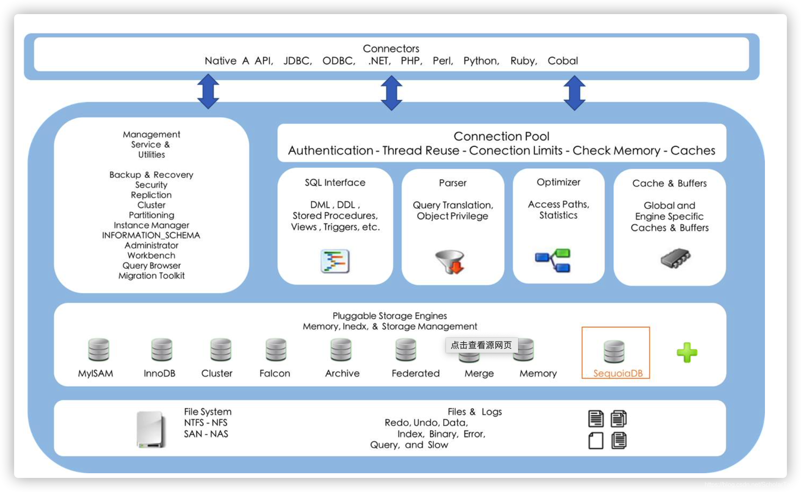

# mysql逻辑架构

## mysql体系结构图

1. 连接层

   最上层是一些客户端和连接服务，包括本地sock通信和大多数基于客户端/服务器实现的类似tcp/ip的通信。主要完成一些类似连接处理，授权认证，及相关的安全方案。在该层上引入了线程池的概念，为通过安全认证接入的客户端提供线程。同样在该层上可以实现基于SSL的安全连接。服务器也会为安全接入的每个客户端验证它具有的操作权限。

2. 服务层

   第二层主要完成大多数的核心服务功能，如SQL接口，并完成缓存的查询，SQL的分析和优化及部分内置函数的执行。所有跨存储引擎的功能也在这一层实现，如过程、函数等。在该层，服务器会解析查询并创建相应的内部解析树，并对其完成相应的优化，如确定查询表的顺序，是否使用索引，最后生成相应的执行操作。如果是select查询，服务器还会查询内部的缓存。如果缓存空间足够大，那么在需要大量查询的环境下，系统的性能会极大提高。

3. 引擎层

   存储引擎层，存储引擎真正负责MySQL中数据的存储和提取，服务器通过API与存储引擎进行通信。不同的存储引擎具有的功能不同，这样我们可以根据自己的实际选取相应的引擎。

4. 存储层

   数据存储层，主要完成将数据存储在运行于裸设备的文件系统上，并完成与存储引擎的交互。