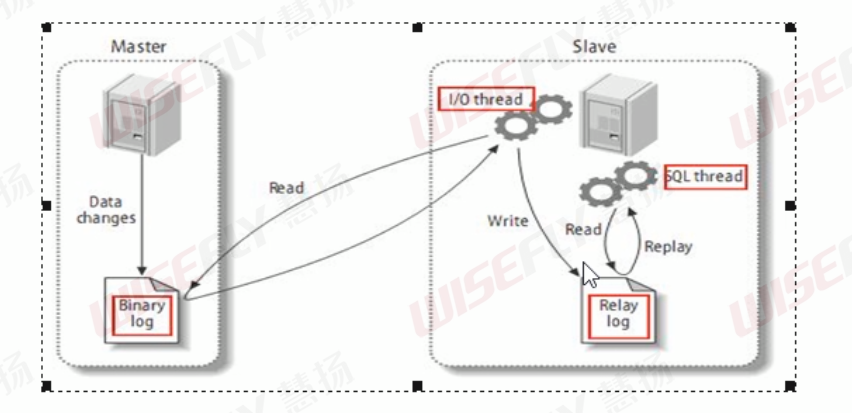

# 主从复制

## 复制的基本原理

slave会从master读取binlog来进行数据同步。



MySQL复制过程分为3步：

1. master将改变记录到二进制日志(binary log)。这些记录过程叫做二进制日志事件，binary log events。
2. slave将master的binary log events拷贝到它的中继日志(relay log)。
3. slave重做中继日志中的事件，将改变应用到自己的数据库。MySQL复制是异步的且串行化的。


## 复制的基本原则

每个slave只能有一个唯一的master。

每个slave只能有一个唯一的服务器id。


## 主从配置

mysql版本一致且后台以服务运行。

主从都配置在[mysqld]结点下，都是小写。


### 主机修改配置

```cnf
server-id=1 #主服务器唯一id
log_bin=/data/mysql/mysqlbin/mysqlbin #启用二进制日志
# 上面是必选，下面是可选
log-err=/usr/local/mysql/mysqlerr #启用错误日志
basedir=/usr/local/mysql #根目录
tmpdir=/usr/local/mysql #临时目录
datadir=/ust/local/mysql/data #数据目录
read-only=0 #主机，读写都可以
binlog-ignore-db=mysql #设置不要复制的数据库
binlog-do-db=mysql #设置需要复制的数据库
```


### 从机修改配置

```cnf
server-id=2
log_bin=mysql-bin #可选，开启logbin日志
```


### 重启主从机

```bash
service mysql restart
```


### 在主机上建立账户并授权slave

账号授权

```mysql
GRANT REPLICATION SLAVE ON *.* TO 'xgc'@'127.0.0.1' IDENTIFIED BY '123456';
```

刷新权限

```mysql
flush privileges;
```

查询master的状态

```mysql
mysql> show master status;
+-----------------+----------+--------------+------------------+-------------------+
| File            | Position | Binlog_Do_DB | Binlog_Ignore_DB | Executed_Gtid_Set |
+-----------------+----------+--------------+------------------+-------------------+
| mysqlbin.000001 |      154 |              |                  |                   |
+-----------------+----------+--------------+------------------+-------------------+
1 row in set (0.00 sec)
```


### 在从机上配置需要复制的主机

配置主机

```mysql
CHANGE MASTER TO MASTER_HOST='127.0.0.1', MASTER_PORT=3307, MASTER_USER='xgc', MASTER_PASSWORD='123456', MASTER_LOG_FILE='mysqlbin.000001', MASTER_LOG_POS=154;
```

启动从机复制功能

```mysql
start slave;
```

查看从机状态

```mysql
show slave status\G
```

Slave_IO_Running: YES

Slave_SQL_Running: YES

上面两个参数同时为YES表示成功


### 测试

在master创建的数据库和表，插入的数据，都可以在slave中看的到。