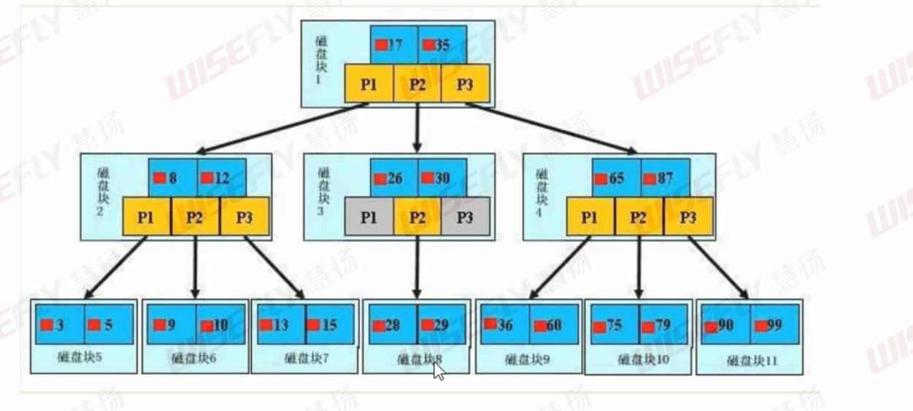
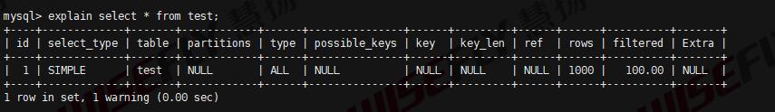

# 索引优化分析

## SQL性能差

SQL性能差(执行时间长，等待时间长)，可能的原因如下：

1. 查询语句写的差
2. 索引不生效
3. 关联查询join太多


## 为什么删除数据都是逻辑删除

1. 方便后期数据分析
2. 频繁删除导致索引失效
3. 方便数据备份


## 索引

### 什么是索引

索引是帮助mysql快速获取数据的数据结构。

一般来说索引文件也很大，不可能都存储在内部，因此索引往往以索引文件的形式保存在磁盘上。

我们平常所说的索引，如果没有特别指明，都是指B树(多路搜索树)结构组织的索引。其中聚集索引，次要索引，覆盖索引，复合索引，前缀索引，唯一索引默认都是使用B+树索引，统称索引。当然，除了B+树这样类型的索引，还有哈希索引等。


### 索引的优势劣势

#### 优势

1. 提高数据检索效率，降低数据库的IO成本
2. 利用索引列对数据进行排序，降低数据排序的成本，降低了CPU的消耗


#### 劣势

1. 索引实际上也是一张表，保存了记录的主键和索引字段，所以索引列也会占用磁盘空间
2. 虽然索引大大提高了查询速度，同时却会降低更新表的速度。因为更新表时，mysql除了要更新表，还有更新对应的索引。


### 索引类型

- 单值索引：即一个索引只包含一个列，一张表能够有多个单值索引
- 唯一索引：索引列的值必须唯一，允许存在空值
- 复合索引：一个索引包含多个列


### 索引语法

- 创建索引

  ```mysql
  CREATE [UNIQUE] INDEX indexname ON mytable(columnname(length));
  ALTER mytable ADD [UNIQUE] INDEX indxname ON (columnname(length));
  ```

- 删除索引

  ```mysql
  DROP INDEX [indexname] ON mytable; 
  ```

- 查看索引

  ```mysql
  SHOW INDEX FROM tablename\G
  ```


还有四种方式来添加数据库的索引

- ALTER TABLE tbl_name ADD PRIMARY KEY (column_list)
- ALTER TABLE tbl_name ADD UNIQUE index_name (column_list)
- ALTER TABLE tbl_name ADD INDEX index_name (column_list)
- ALTER TABLE tbl_name ADD FULLTEXT  index_name (column_list)


### 索引结构和检索原理

索引结构分为BTree索引、Hash索引、full-text全文索引、R-Tree索引


#### BTree索引




上面是一颗B+树，浅蓝色的块称之为磁盘块，每个磁盘块包含几个数据项(深蓝色)和指针(黄色)。以磁盘块1为例，P1指向小于17的磁盘块，P2指向大于17小于35的磁盘块，P3指向大于35的磁盘块。

**真实的数据都存放在叶子节点。**非叶子节点不存放数据，只存储指引搜索方向的数据项。


### 什么情况需要建立索引

1. 主键自动建立唯一索引
2. 频繁作为查询条件的字段应该创建索引
3. 查询中与其他表关联的字段，外键关系建立索引
4. 频繁更新的字段不适合建立索引
5. where条件里用不到的字段，不要建立索引
6. 单键/组合索引的选择问题(在高并发下倾向创建组合索引)
7. 查询中排序的字段，排序字段若通过索引去访问将大大提高排序速度
8. 查询中统计或分组字段


### 什么情况不要创建索引

1. 表记录太少

2. 经常增删改的表

3. 数据重复且平均的表，因此应该只为最经常查询和最经常排序的数据列建立索引。

   注意，如果某个数据列包含许多重复的内容，为它建立索引就没有太大的实际效果

> 索引的选择性是在索引列中不同值的数目与表中记录数比。如果一个表有2000条数据，索引列有1980个不同值，那么这个索引的选择性就是0.99
>
> 一个索引的选择行越接近1，这个索引的效率就越高


## 性能分析

### Mysql Query Optimizer

1. MySQL中有专门负责优化SELECT语句的优化器模块。能够通过计算分析系统中收集的统计信息，为客户端请求的Query提供它认为最优的执行计划。(他认为最优的数据检索方式，不一定是DBA认为最优的)

2. 当客户端向MySQL请求一条Query，命令解析器完成请求分类，区别出SELECT并转发给Mysql Query Optimizer，Mysql Query Optimizer首先会对整条Query进行优化，处理一些常量表达式的预算，直接换算成常量值，并对Query的查询条件进行简化和转换，如去除一些无用或显而易见的条件、结构调整等。

   然后分析Query的Hint信息(如果有)，看Hint信息是否可以完全确定Query的执行计划。如果没有hint或hint信息不足以完全确认执行计划，则会读取所涉及对象的统计信息，根据Query进行相应的计算分析，然后再得到最后的执行计划


### MySQL常见瓶颈

- CPU：CPU在饱和的时候一般发生在从硬盘读取数据或写入数据
- IO：磁盘I/O瓶颈发生在装入数据大于磁盘内存
- 服务器硬件的性能瓶颈：top，free，iostat和vmstat来查看系统的性能状态


### explain

#### explain简介

使用EXPLAIN关键字可以模拟优化器执行SQL查询语句，从而知道MySQL是如何处理SQL语句。分析查询语句或表结构的性能瓶颈。

使用explain作用：

1. 表的读取顺序
2. 数据读取操作的操作类型
3. 哪些索引可以使用
4. 哪些索引实际被使用
5. 表之间的引用
6. 每张表有多少行被优化器查询


#### explain分析字段讲解




##### id

id指的是select查询的流水号，包含一组数字，表示查询中执行select子句或操作表的顺序。

id分为三种情况

- id相同，执行顺序由上到下

- id不同，如果是子查询，id的序号会递增。id值越大优先级越高，越先被执行

- id相同不同，同时存在

  如果id相同，可以认为是一组，从上往下顺序执行。

  在所有组中，id值越大优先级越高，越先被执行。


##### select_type

select_type类型

1. SIMPLE

   简单的select查询，查询中不包含子查询或者UNION

2. PRIMARY

   查询中若包含任何复杂的子查询，最外层则被标记为

3. SUBQUERY

   在SELECT或WHERE列表中包含子查询

4. DERIVED

   在FROM列表中包含的子查询会被标记为DERIVED(衍生)。

5. UNION

   第二个SELECT出现在UNION后面，则被标记为UNION。

6. UNION RESULT

   从UNION表获取结果的SELECT


##### type

访问类型排列，显示查询使用了哪种类型

从最好到最差是：

`system > const > eq_ref > ref > range >index > all`

一般来说，得保证查询至少达到range级别，最好能达到ref。


1. system

   表只有一条记录(相当于系统表)，这是const的特例，平时不会出现

2. const

   表示通过索引一次就找到了，const用于比较primary key或者unique索引。因为只匹配一行数据，所以很快。如将主键置于where列表中，MySQL就能将该查询转换成一个常量。
   
3. qr_ref

   唯一性索引扫描，对于每个索引键，表中只有一条记录与之匹配。常见于主键或唯一索引扫描

4. ref

   非唯一性索引扫描，返回匹配某个单独值的所有行

   本质上也是一种索引访问，它返回所有匹配某个单独值的行。属于查找和扫描的混合体

5. range

   只检索给定范围的行，使用一个索引来选择行。key列显示使用了哪个索引。一般就是在查询的where语句出现了between、<、>、in等的查询。

6. index

   只遍历索引树

7. all

   遍历整个表


##### possible_keys

显示可能应用在这张表中的索引，一个或多个。

查询涉及到的字段上若存在索引，则列出。**但实际不一定被使用。**


##### key

实际使用到的索引。如果为NULL，则没有使用索引。

查询中若使用了覆盖索引，则该索引仅出现在key列表中


##### key_len

表示索引中使用的字节数，可通过该列计算查询中使用的索引的长度。在不损失精确性的情况下，长度越短越好。

key_len显示的值为索引字段的最大可能长度，**并非实际使用长度。**即key_len是根据表定义计算而得，不是通过表内检索出得。		


##### ref

显示索引的哪一列被使用。最好是一个常量值。


##### row

根据表统计情况和索引选用情况，大致估算出找到需要的记录需要读取的行数。


##### extra

包含不适合在其他列中显示但十分重要的额外信息。

1. Using filesort

   说明mysql会对数据使用一个外部的索引排序，而不是按照表内索引进行读取。

   myslq无法利用索引完成的排序操作叫做“文件排序”

2. Using temporary

   使用了临时表存储中间结果，mysql对查询结果进行排序时使用临时表。常见于排序order by和分组查询group by

3. Using index

   表示相应的select操作中使用了覆盖索引(Covering Index)，避免访问了表的数据行，效率不错。

   如果同时出现了where，那么表示索引被用来执行索引键值的查找

   如果没有同时出现using where，表示索引用来读取数据而非执行查找动作。

   > 覆盖索引：也叫做索引覆盖
   >
   > ​	理解方式1：就是select的数据列只从索引中就能取得，不必读取数据行，MySQL可以利用索引返回select列表中的字段，而不必根据索引再次读取数据文件，换句话就是**查询列被所见的索引覆盖。**
   >
   > ​	理解方式2：索引是高效找到行的一个方法，当能通过检索索引就可以读取想要的数据，那就不需要再到数据表中读取行了。如果一个索引包含了（或覆盖了）满足查询语句中字段与条件的数据就叫做覆盖索引。

4. Using where

   表示使用了where

5. Using join buffer

   使用了连接缓存

6. impossible where

   where的条件值总为false

7. select tables optimized away

   在没有GROUPBY子句的情况下，基于索引优化MIN/MAX操作或者对于MyISAM存储引擎优化COUNT(*)操作，不必等到执行阶段再进行计算，查询执行计划生成的阶段就完成优化

8. distinct

   优化distinct操作，在找到第一匹配的元组后即停止找同样值的动作。


## 索引失效

1. 最佳左前缀法则

   如果索引了多列，要遵循最佳左前缀法则。值得是查询从索引的最左前列开始并且不跳过索引中的列。

2. 不在索引列上做任何操作(计算、函数、(自动或手动)类型转换)，会导致索引失效而转向全表扫描

3. 存储引擎不能使用索引中范围条件右边的列

4. 尽量使用覆盖索引，不要使用*

5. mysql在使用不等于(!= 或者 <>)的时候会无法使用索引而导致全表扫描

6. is null，is not null也无法使用索引

7. like以通配符开头(`'%abc'`)，mysql索引失效而导致全表扫描

   如何解决like以通配符开头，mysql索引不被使用的问题？ -- 使用覆盖索引

8. 字符串不加单引号会导致索引失效

9. 少用or，用它来连接时会索引失效


