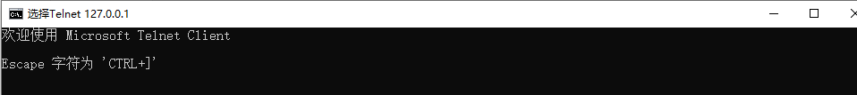

# BIO

## BIO基本介绍

1. Java BIO就是**传统的java io编程**，其相关的类和接口在java.io。

2. BIO(blocking I/O)：**同步阻塞**，服务器实现模式为一个连接一个线程，即客户端有连接请求时服务器端就需要启动一个线程进行处理，如果这个连接不做任何事情会造成不必要的线程开销，可以通过线程池机制改善。
3. BIO方式适用于连接数目比较小且固定的架构，这种方式对服务器资源要求比较高，并发局限于应用中，JDK1.4之前唯一选择，程序简单易理解


## 实例

简单BIO实例程序如下：

```java
public class BIOServer {

    public static void main(String[] args) throws IOException {
        // 线程池机制
        // 思路:
        // 1.创建一个线程池
        // 2.如果有客户端连接，就创建一个线程，与之通信(单独写一个方法)

        ExecutorService pool = Executors.newCachedThreadPool();

        ServerSocket serverSocket =  new ServerSocket(6666);
        System.out.println("服务器启动了");

        while(true) {
            final Socket socket = serverSocket.accept();
            System.out.println("连接到一个客户端");

            //就创建一个线程，与之通信
            pool.execute(new Runnable() {
                @Override
                public void run() {
                    handler(socket);
                }
            });
        }
    }

    //编写一个handler方法，和客户端通讯
    public static void handler(Socket socket) {
        byte[] bytes = new byte[1024];
        //通过socket获取字节流
        try {
            InputStream inputStream = socket.getInputStream();

            //循环的读取客户端发送的数据
            while (true) {
                int read = inputStream.read(bytes);
                if (read != -1) {
                    System.out.println(new String(bytes, 0, bytes.length));
                } else {
                    break;
                }
            }
        } catch (IOException e) {
            e.printStackTrace();
        } finally {
            System.out.println("关闭和client的连接");
            try {
                socket.close();
            } catch (IOException e) {
                e.printStackTrace();
            }
        }
    }
}
```

1. 启动程序

2. 打开cmd输入命令

   ```cmd
   telnet 127.0.0.1 6666
   ```

3. 之后输入 ctrl + ]，进入交互界面

   

4. 输入`send hello`

   ```cmd
   Microsoft Telnet> send hello
   发送字符串 hello
   ```

5. 程序运行输出如下：

   ```
   服务器启动了
   连接到一个客户端
   hello
   ```


## BIO问题分析

1. 每个请求都需要创建独立的线程，与对应的客户端进行数据Read，业务处理，数据write
2. 当并发量较大时，需要创建大量线程来处理连接，系统资源占用较大
3. 连接建立后，如果当前线程暂时没有数据可读，则线程就阻塞在Read操作上，造成线程资源浪费

