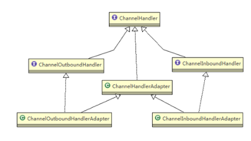
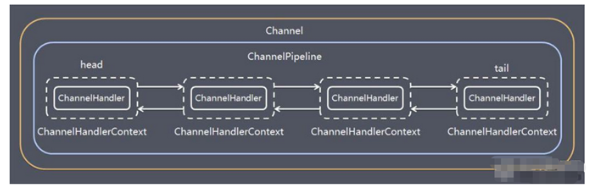

# Netty核心组件

## Bootstrap、ServerBootstrap

一个Netty应用通常由一个Bootstrap开始，主要作用是配置整个Netty程序，串联各个组件，Netty中Bootstrap类是客户端程序的启动引导类，ServerBootstrap是服务器启动引导类。


## Future、ChannelFuture

Netty中所有IO操作都是异步的，会立即返回一个ChannelFuture对象。通过这个对象可以注册一个监听，当操作执行成功或失败时监听会自动触发注册的监听事件


### 常见的方法

```java
Channel channel(); //返回当前正在进行IO操作的通道
ChannelFuture sync(); //等待异步操作执行完毕
```


## Channel

1. Netty网络通信的组件，能够用于执行网络IO操作
2. 通过Channel可获得当前网络连接的通道的状态
3. 通过Channel可获得网络连接的配置参数(例如接收缓冲区大小)
4. Channel提供异步的网络IO操作(如建立连接，读写，绑定端口)
5. 调用立即返回一个ChannelFuture对象，可以通过注册监听到ChannelFuture对象
6. 支持关联IO操作与对应的处理程序
7. 不同协议，不同阻塞类型的连接都有不同的Channel类型与之对应，常用的Channel类型有：
   - NioSocketChannel：异步的客户端TCP连接
   - NioServerSocketChannel：异步的服务器端TCP连接
   - NioDatagramChannel：异步的UDP连接
   - NioSctpChannel：异步的客户端Sctp连接
   - NioSctpServerChannel：异步的服务器端Sctp连接，这些通道涵盖了UDP和TCP网络IO以及文件IO


## Selecot

1. Netty基于Selector实现IO多路复用，通过Selctor一个线程可以监听多个连接的Channel事件
2. 当向一个Selector中注册Channel后，Selector内部的机制就可以自动不断地查询(select)这些注册的Channel是否有就绪写IO事件，这样就可以实现一个线程高效的管理多个Channel


## ChannelHandler及其实现类

1. ChannelHandler是一个接口，处理IO事件或拦截IO操作，并将其转发到其ChannelPipeline(业务处理链)中的下一个处理程序
2. ChannelHandler本身没有提供很多方法，因为这个接口有许多的方法需要实现，方便使用期间，可以继承它的子类




- ChannelInboundHandler：用于处理入站IO事件
- ChannelOutboundHandler：用于处理出站IO事件

//适配器

- ChannelInboundHandlerAdapter：用于处理入站IO事件
- ChannelOutboundHandlerAdapter：用于处理出站IO事件
- ChannelDuplexHandler：用于处理入站和出站IO事件


3. ChannelPipeline提供了ChannelHandler链的容器，以客户端应用程序为例，如果事件的运动方向是从客户端到服务器端的，那么我们称这些事件为出站。即客户端发送给客户端的数据会通过Pipeline中的一系列ChannelOutboundHandler处理。


## Pipeline和ChannelPipeline

1. ChannelPipeline是一个Handler的集合，它负责处理和拦截inbound或者outbound事件和操作，相当于一个贯穿Netty的链。

2. ChannelPipeline实现了一种高级形式的拦截过滤器模式，使用户可以完全控制事件的处理方式，以及Channel中的各个ChannelHandler如何相互交互

3. 在Netty中每个Channel都有且仅有一个ChannelPipeline与之对应，它们的组成关系如下：

   

   - 一个Channel包括了一个ChannelPipeline，而ChannelPipeline中又维护了一个由ChannelHandlerContext组成的双向链表，并且每个ChannelHandlerContext中又关联着一个ChannelHandler。
   - 入站事件和出站事件在一个双向链表中，入站事件会从链表head往后传递到最后一个入站的handler，出站事件会从链表tail向前传递到最前一个出站的handler。两种类型的handler互不干扰。


### 常见方法

```java
ChannelPipeline addFirst(ChannelHandler... handlers);
ChannelPipeline addLast(ChannelHandler... handlers);
```


## ChannelHandlerContext

1. 保存Channel相关的所有上下文对象，同时关联与一个ChannelHandler对象
2. 即ChannelHandlerContext中包含一个具体的事件处理器ChannelHandler，同时ChannelHandlerContext中也绑定了对应的pipeline和Channel的信息，方便对ChannelHandler进行调用


### 常用方法

```java
ChannelFuture close(); //关闭通道
ChannelOutboundInvoker flush(); //刷新
//将数据写到ChannelPipeline中当前ChannelHandler的下一个ChannelHandler开始处理(出站)
ChannelFuture writeAndFlush(Object msg);
```


## ChannelOption

1. Netty在创建Channel实例后，一般都需要设置ChannlOption参数

2. ChannelOption参数如下：

   - ChannelOption.SO_BACKLOG

     对应TCP/IP协议listen函数中的backlog参数，用于初始化服务器可连接队列大小。服务器处理客户端连接请求是顺序处理的，同一时间只能处理一个客户端连接。多个客户端来的时候，服务器将不能处理的客户端连接请求放在队列中等待处理。backlog参数执行了队列的大小。

   - ChannelOption.SO_KEEPALIVE

     一直保持连接活动状态


## EventLoopGroup和其实现类NioEventLoopGroup

1. EventLoopGroup是一组EventLoop的抽象，Netty为了更好的利用多核CPU资源，一般会有多个EventLoop同时工作，每个EventLoop维护着一个Selector实例
2. EventLoopGroup提供next接口，可以从组里面按照一定规则获取一个EventLoop来处理任务。
3. 通常一个服务端口，即一个ServerSocketChannel对应一个Selector和一个EventLoop线程。BossEventLoop负责接收客户端的连接并将SocketChannel交给WorkerEventLoopGroup来进行IO处理。


## Unpooled类

Netty提供一个专门用来操作缓冲区(即Netty的数据容器)的工具类


### 常用方法

```java
//通过给定的数据和字符编码返回一个ByteBuf对象
public static ByteBuf copiedBuffer(CharSequence string, Charset charset);
```


## 编码和解码

1. 编写网络应用程序时，因为数据在网络中传输的都是二进制字节码数据，在发送数据时就需要编码，接收数据时就需要解码

2. codec(编解码器)的组成部分有两个：decoder(解码器)和encoder(编码器)

   encoder负责将业务数据转换成字节码数据

   decoder负责将字节码数据转换成业务数据

3. Netty自身提供了一些codec

   - StringEncoder，StringDecoder
   - ObjectEncoder，ObjectDecoder，对Java对象进行编解码

4. Netty本身自带的ObjectDecoder和ObjectEncoder可以用来实现POJO对象或各种业务对象的编码解码，底层使用的是Java序列化技术，而Java序列化技术本身效率不高，存在如下问题：

   - 无法跨语言
   - 序列化的体积太大，是二进制编码的5倍多
   - 序列化性能太低

   所以出现了新的解决方案：Google的ProtoBuf


### 常用解码器

#### RelayingDecoder

```java
public abstract class RelayingDecoder<S> extends ByteToMessageDecoder
```

RelayingDecoder扩展了ByteToMessageDecoder类，使用这个类，我们不必调用readableBytes()方法。参数S指定了用户状态管理的类型，其中Void代表不需要状态管理。

缺点：

1. 并不是所有的ByteBuf操作被支持
2. ReplayingDecoder在某些情况下可能稍慢于ByteToMessageDecoder，例如网络缓慢并且消息格式复杂时，消息会被拆分了多个碎片，速度变慢。


#### LineBasedFrameDecoder

这个类在Netty内部也有使用，它使用行尾控制字符(`\n`或者`\r\n`)作为分隔符来解析数据


#### DelimiterBasedFrameDecoder

使用自定义的特殊字符作为消息的分隔符


#### HttpObjectDecoder

一个Http数据的解码器长度来标识整包消息，这样就可以自动的处理粘包和半包消息。


