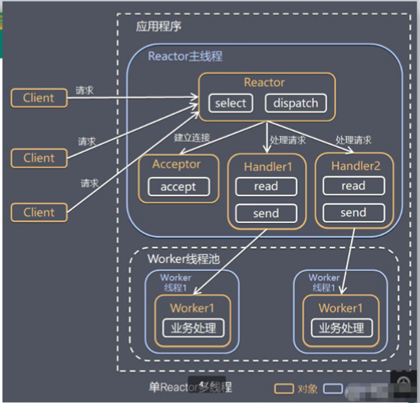

# Netty线程模型

## 线程模型基本介绍

不同的线程模型对程序的性能有着很大影响。

目前存在的线程模型有：

- 传统阻塞I/O服务模型

- Reactor模型

  根据Reactor的数量和处理资源池线程的不同，有3种典型的实现：

  - 单Reactor单线程
  - 单Reactor多线程
  - 主从Reactor多线程

- Netty线程模式(Netty主要基于**主从Reactor多线程模型**做了一定的改进)

## 传统阻塞I/O服务模型

**模型特点**

1. 采用阻塞IO模式获取输入的数据
2. 每个连接都需要独立的线程完成数据的输入、业务处理、数据返回

**问题分析**

1. 当并发数很大，就会创建大量的线程，占用很大系统资源
2. 连接创建后，如果当前线程暂时没有数据可读，该线程会阻塞在read操作，造成线程资源浪费

## Reactor模式

Reactor对应的叫法：

1. 反应器模式
2. 分发者模式(Dispatcher)
3. 通知者模式(notifier)

### 针对传统阻塞IO服务模型解决方案

1. 针对I/O复用模型：多个连接共用一个阻塞对象，应用程序只需要在一个阻塞对象等待，无需阻塞等待所有连接。当某个连接有新的数据可以处理时，操作系统通知应用程序，线程从阻塞状态返回，开始进行业务处理。
2. 基于线程池复用线程资源：不必为每个连接创建线程，将连接后的业务处理任务分配给线程进行处理，一个线程可以处理多个连接的业务

### 模型图

I/O复用结合线程池就是Reactor模式基本设计思想。

1. Reactor模式，通过一个或多个输入同时传递给服务处理器的模式(基于事件驱动)
2. 服务器端程序处理传入的多个请求，并将它们同步分派到相应的处理线程，所以也叫分发者(Dispatcher)模式
3. Reactor模式使用IO复用监听事件，收到事件后，分发给某个线程(进程)，这就是网络服务器高并发处理关键

### 核心组成

1. Reactor：Reactor在一个单独的线程中运行，负责监听和分发事件，分发给适当的处理程序来对IO事件进行反应。
2. Handlers：处理程序执行I/O事件要完成的实际事件。

## 单Reactor单线程

**说明：**

1. Select可以实现应用程序通过一个阻塞对象监听多路连接请求
2. Reactor对象通过Select监听客户连接事件，收到事件后通过Dispatcher进行分发
3. 如果是连接事件，由Acceptor通过accept处理连接请求，然后创建一个Handler对象来处理连接后的后续业务处理
4. 如果不是连接事件，则会被分发到Handler来处理
5. Handler会完成read -> 业务处理 -> send的完整业务流程

**方案优缺点分析：**

1. 优点：模型简单，没有多线程、进程通信、竞争的问题，全部都在一个线程中完成
2. 缺点：性能问题，只有一个线程，无法完全发挥CPU的性能。Handler在处理某个连接的业务时，整个进程无法处理其他连接事件，很容易造成性能瓶颈
3. 缺点：可靠性问题，线程意外终止，或者进入死循环，会导致整个系统通信模块不可用，不能接收或处理外部消息，造成节点故障
4. 使用场景：客户端的数量有限，业务处理非常快速。

## 单Reactor多线程

**说明：**

1. Reactor对象通过select监控客户端请求事件，收到事件后，通过dispatch进行分发
2. 如果建立连接请求，则Acceptor通过accept处理连接请求，然后创建一个Handler对象处理完成连接后的请求
3. 如果不是连接请求，则由Reactor分发调用连接对应的handler来处理
4. handler只负责响应事件，不做具体的业务处理，通过read读取数据后，会分发给后面的worker线程池中的某个线程完成业务处理
5. worker线程池会分配独立线程完成业务，并将结果返回给handler
6. handler收到响应后，会通过send将结果发送给Client

**方案优缺点：**

1. 优点：可以充分用多核CPU的处理能力
2. 缺点：多线程数据共享和访问比较复杂，reactor处理所有事件的监听和响应，在单线程运行，在高并发场景下容易出现性能瓶颈

## 主从Reactor多线程

**说明：**

1. Reactor主线程MainReactor对象通过select监听连接事件，收到事件后，通过Acceptor对象处理连接请求
2. 当Acceptor处理连接事件后，MainReactor将连接分配给SubReactor
3. SubReactor将连接加入连接队列进行监听，并创建Handler进行各种事件处理
4. 当有新事件发生时，SubReactor就会调用对应的handler进行处理。
5. handler通过read从连接读取数据，分发给worker线程池处理
6. worker线程池分配独立的worker线程进行业务处理，并返回结果
7. handler收到结果后，通过send发生将结果返回给client
8. Reactor主线程可以有多个Reactor子线程，即MainReactor可以关联多个SubReactor

**方案优缺点：**

1. 优点：父线程与子线程的数据交互简单职责明确，父线程只需要接收新连接，子线程完成后续的业务处理
2. 缺点：编程复杂

## Netty模型

### 简单版

**说明：**

1. BossGroup线程维护Selector，只关注accept
2. 当接收到Accept事件，获取到对应的SocketChannel，封装成NIOSocketChannel，然后注册到WorkerGroup的Selector中，并进行维护
3. 当Worker线程监听到selector中通道发生自己感兴趣的事件后，就进行处理

### 详细版

**说明：**

1. Netty抽象出两个线程组：BossGroup负责客户端的接收，WorkerGroup专门负责网络的读写
2. BossGroup和WorkerGroup都是NioEventLoopGroup类型
3. NioEventLoopGroup是一个事件循环组，里面有多个事件循环，每一个事件循环都是NioEventLoop
4. NioEventLoop表示一个不断循环的执行处理任务的线程，每个NioEventLoop都有一个Selector，用于监听绑定在其上的socket的网络通讯
5. NioEventLoopGroup可以有多个线程，即有多个NioEventLoop
6. 每个Boss NioEventLoop循环执行的步骤：
   1. 轮询accept事件
   2. 处理accept事件，与client建立连接，生成NioSocketChannel，并将其注册到某个Worker NioEventLoop上的Selector
   3. 处理任务队列的任务，即runAllTasks
7. 每个Worker NioEventLoop循环执行的步骤：
   1. 轮询read、write事件
   2. 处理io事件，即read、write事件，在对应的NioSocketChannel处理
   3. 处理任务队列的任务，即runAllTasks
8. 每个Worker NioEventLoop处理业务时，会使用pipeline(管道)，pipeline包含了channel，即通过pipeline可以获取到对应通道，管道中维护了很多的处理器