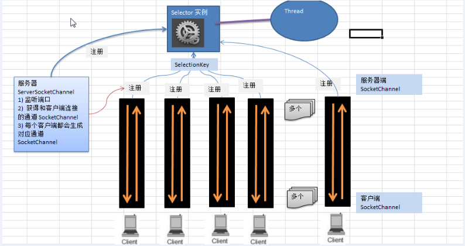

# Selector

## Selector简介

1. Java的NIO，用非阻塞的IO方式。可以用一个线程处理多个客户端连接，就会用到Selector
2. Selector能够检测到多个注册的通道上事件的发生。如果有事件发生，就获取事件并对事件进行处理。这样就可以只用一个单线程去管理多个通道，即管理多个连接和请求
3. 只有在有读写事件发生的时候，才会进行读写，大大减少了系统开销。
4. 减少了多线程之间的上下文切换开销


## Selector类相关方法

Selector类是一个抽象类，常用方法和抽象如下：

```java
public abstract class Selector implements Closeable {
    public abstract Selector open; //得到一个选择器对象
    //监控所有注册的通道，当其中有IO操作可以进行时，将对应的SelectionKey加入到内部集合中并返回，参数用来设置超时时间
    public int select(long timeout); 
    //从内部集合中得到所有的SelectionKey
    public Set<SelectionKey> selectedKeys();
}
```


## NIO非阻塞网络编程原理

NIO非阻塞网络编程相关的Selector、SelectionKey、ServerSocketChannel、SocketChannel关系梳理图




1. 当客户端连接，会通过ServerSocketChannel得到SocketChannel
2. Selector进行监听select方法，返回有事件发生的通道的个数
3. 将socketChannel注册到Selector上，register(Selector sel, int ops)，一个Selector可以注册多个Channel
4. 注册后返回一个SelectionKey
5. 进一步获得各个SelectionKey(有事件发生)
6. 再通过SelectionKey获得SocketChannel，方法channel()
7. 可以通过获得的SocketChannel完成业务处理


## 示例

服务器端代码

```java
/**
 * NIO实现服务器端和客户端的数据简单通讯(非阻塞)
 */
public class NIOServer {

    public static void main(String[] args) throws IOException {
        ServerSocketChannel serverSocketChannel = ServerSocketChannel.open();

        Selector selector = Selector.open();

        //绑定6666端口，监听
        serverSocketChannel.socket().bind(new InetSocketAddress(6666));
        //设置为非阻塞
        serverSocketChannel.configureBlocking(false);

        //将ServerSocketChannel注册到Selector中，关注OP_ACCEPT事件
        serverSocketChannel.register(selector, SelectionKey.OP_ACCEPT);

        //循环等待客户端连接
        while (true) {
            if (selector.select(1000) == 0) {
                System.out.println("没有事件发生");
                continue;
            }

            //如果select返回不等于0，就获取相关的selectionKey集合
            //获取关注事件的集合
            Set<SelectionKey> selectionKeys = selector.selectedKeys();

            Iterator<SelectionKey> iterator = selectionKeys.iterator();
            if (iterator.hasNext()) {
                SelectionKey selectionKey =  iterator.next();
                if (selectionKey.isAcceptable()) {
                    //为新的客户端生成一个socketChannel
                    SocketChannel socketChannel = serverSocketChannel.accept();
                    //将生成的socketChannel设置为非阻塞
                    socketChannel.configureBlocking(false);
                    //将socketChannel注册到selector,同时关注时间OP_READ，同时给SocketBuffer关联
                    socketChannel.register(selector, SelectionKey.OP_READ, ByteBuffer.allocate(1024));

                }
                if (selectionKey.isReadable()) {
                    SocketChannel socketChannel = (SocketChannel) selectionKey.channel();
                    //获取该channel关联的buffer
                    ByteBuffer buffer = (ByteBuffer) selectionKey.attachment();
                    socketChannel.read(buffer);
                    System.out.println("from 客户端：" + new String(buffer.array()));
                }

                //手动从集合中移除当前的SelectionKey，防止重复操作
                iterator.remove();
            }
        }


    }
}
```

客户端代码

```java
public class NIOClient {

    public static void main(String[] args) throws IOException {
        //得到网络通道
        SocketChannel socketChannel = SocketChannel.open();
        socketChannel.configureBlocking(false);

        InetSocketAddress inetSocketAddress = new InetSocketAddress("127.0.0.1", 6666);
        //连接服务器
        if (!socketChannel.connect(inetSocketAddress)) {
            while (!socketChannel.finishConnect()) {
                System.out.println("连接尚未成功，客户端不会阻塞，可以执行其他任务");
            }
        }

        //如果连接成功，就发送数据
        String str = "hello world";
        // Wraps a byte array into a buffer
        ByteBuffer byteBuffer = ByteBuffer.wrap(str.getBytes());
        socketChannel.write(byteBuffer);
        System.in.read();
    }
}
```


## SelectionKey简介

SelectionKey表示Selector和网络通道的注册关系，共四种：

- OP_READ：代表读操作，值为1
- OP_WRITE：代表写操作，值为4
- OP_CONNECT：代表连接已经建立，值为8
- OP_ACCEPT：有新的网络连接可以accept，值为16

```java
public static final int OP_READ = 1 << 0;
public static final int OP_WRITE = 1 << 2;
public static final int OP_CONNECT = 1 << 3;
public static final int OP_ACCEPT = 1 << 4;
```


## SelectionKey相关方法

```java
public abstract class SelectionKey {
    public abstract Selector selector();
    public abstract SelectableChannel channel();
    //得到与之关联的共享数据
    public final Object attachment();
    //设置或改变监听事件
    public abstract SelectionKey interestOps(int ops);
    public final boolean isAcceptable();
    public final boolean isReadable();
    public final boolean isWritable();
}
```

