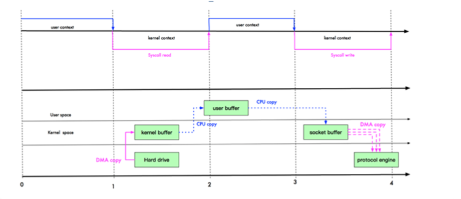
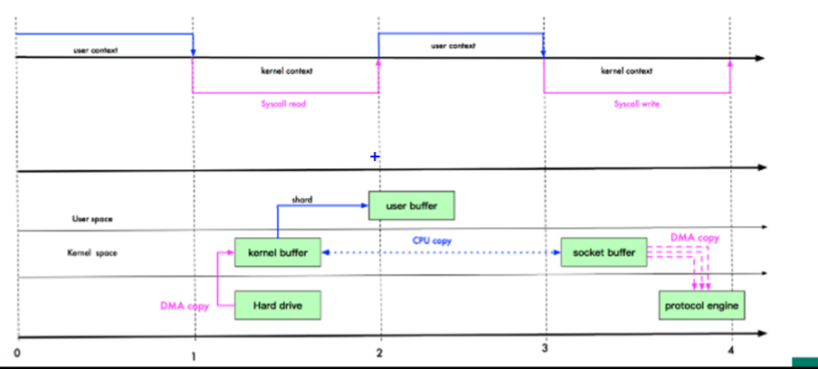
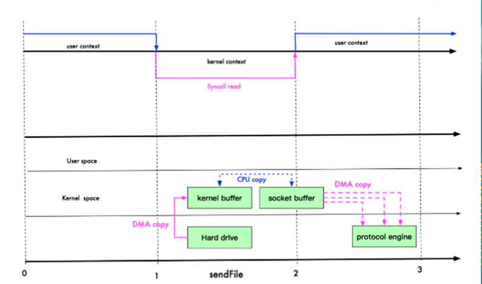
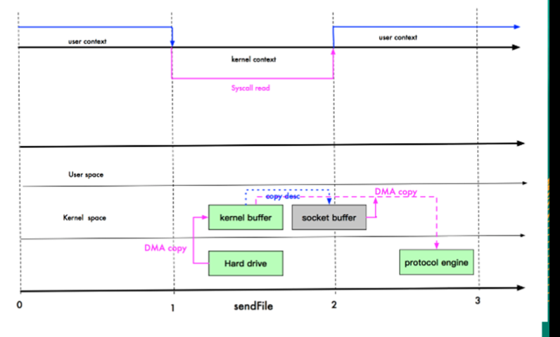

# 零拷贝

在Java程序中，常见的零拷贝有mmap(内存映射)和sendFile。

零拷贝是从操作系统的角度来说的，因为内核缓冲区之间，没有数据是重复的(只有kernel buffer有一份数据)。

零拷贝不仅带来更少的数据复制，还能带来其他性能优势。例如更少的上下文切换，更少的CPU缓存伪共享以及无CPU检验和计算。

## 传统IO

传统IO发生了四次拷贝，三次切换。

拷贝过程：hard drive -> kernel buffer -> user buffer --> socket buffer -> protocol engine

其中hard drive -> kernel buffer和socket buffer -> protocol engine是DMA copy

而kernel buffer -> user buffer 和 user buffer -> socket buffer是CPU拷贝

## mmap优化

mmap通过内存映射，将文件映射在内核缓冲区，同时用户空间可以共享内核空间的数据。这样，在网络传输时，减少内核空间到用户空间的拷贝次数。

mmap发生了三次拷贝，三次切换。

减少了从kernel buffer -> user buffer的一次CPU copy

## sendFile优化

1. Linux2.1版本提供了sendFile函数，其基本原理如下：数据不经过用户态，直接从内核缓冲区到SocketBuffer。同时由于和用户态无关，就减少了一次上下文切换。

   

   发生了3次拷贝，2次切换。

2. Linux在2.4版本中，做了一些修改，避免了从内核缓冲区拷贝到SocketBuffer的操作，直接拷贝到协议栈，从而减少了一次数据拷贝。

   

   发生了2次拷贝，2次切换。

   这里其实还有一次CPU拷贝，从kernel buffer -> socket buffer。但是，信息很少，比如length，offset，消耗低，忽略不计。

## mmap和sendFile的区别

1. mmap适合小数据量读写，sendFile适合大文件传输
2. mmap需要3次拷贝，3次切换。sendFile需要2次拷贝，2次切换

