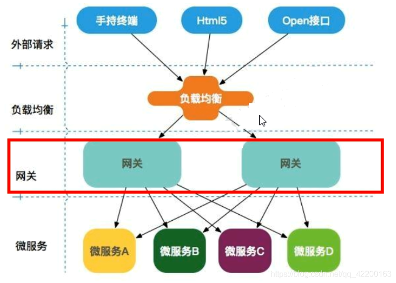

# Gateway简介

## 什么是Gateway

Cloud全家桶中有个很重要的组件就是网关，在1.x版本中都是采用的Zuul网关。

但在2.x版本中，zuul的升级一直跳票，SpringCloud最后自己研发了一个网关替代Zuul。

SpringCloud Gateway是SpringCloud的一个全新项目，基于Spring 5.0+SpringBoot 2.0和Project Reactor等技术开发的网关，它旨在为微服务架构提供一种简单有效的统一的API路由管理方式。

SpringCloud Gateway作为SpringCloud生态系统中的网关，目的是替代Zuul，在Spring Cloud 2.0以上版本中，没有对新版本的Zuul 2.0以上最新高性能版本进行集成，仍然还是使用Zuul 1.0非Reactor模式的老版本。而为了提升网关的性能，SpringCloud Gateway是基于WebFlux框架实现的，而WebFlux框架底层则使用了高性能的Reactor模式通信框架Netty。

SpringCloud Gateway的目标提供统一的路由方式且基于Filter链的方式提供了网关基本的功能，例如：安全，监控/指标，和限流。

## Gateway在微服务架构中的位置

## SpringCloud Gateway的特性

- 动态路由：能够匹配任何请求属性
- 可以对路由指定Predicate(断言)和Filter(过滤器)
- 集成Hystrix的断路器功能
- 集成SpringCloud服务发现功能
- 易于编写的Predicate(断言)和Filter(过滤器)
- 请求限流功能
- 支持路径重写

## SpringCloud Gateway与Zuul的区别

在SpringCloud Finchley正式版之前，SpringCloud推荐的网关是Netflix提供的Zuul。

1. Zuul 1.x，是一个基于阻塞I/O的API Gateway
2. Zuul 1.x**基于Servlet 2.5使用阻塞架构**。它不支持任何长连接(如Websocket)。Zuul的设计模式和Nginx比较像，每次I/O操作都是从工作线程中选择一个执行，请求线程被阻塞到工作线程完成，但是差别是Nginx用C++实现，Zuul用Java实现，而JVM本身会有第一次加载较慢的情况，使得Zuul的性能相对较差。
3. Zuul 2.x理念更先进，想基于Netty非阻塞和支持长连接，但SpringCloud目前还没有整合。Zuul 2.x性能较Zuul 1.x有较大提升。在性能方面，根据官方提供的基准测试，SpringCloud Gateway的RPS(每秒请求数)是Zuul的1.6倍。
4. SpringCloud Gateway建立在Spring Framework 5、Project Reactor和Spring Boot 2之上，使用非阻塞API
5. SpringCloud Gateway还支持WebSocket，并且与Spring紧密集成拥有更好的开发体验。

## 三大核心概念

- Route(路由)：路由是构建网关的基本模块，它由ID、目标URI，一系列的断言和过滤器组成。如果断言为true则匹配该路由
- Predicate(断言)：参考的是Java8的java.util.function.Predicate。开发人员可以匹配HTTP请求中的所有内容(例如请求头或请求参数)，**如果请求和断言相匹配则进行路由**
- Filter(过滤)：指的是Spring框架中GatewayFilter的实例，使用过滤器，可以在请求被路由前后对请求进行修改。