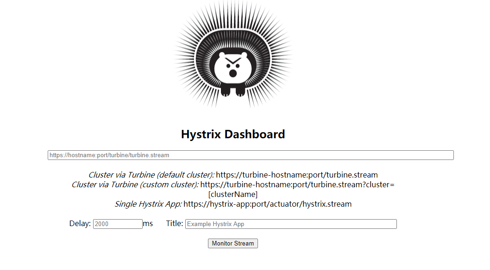
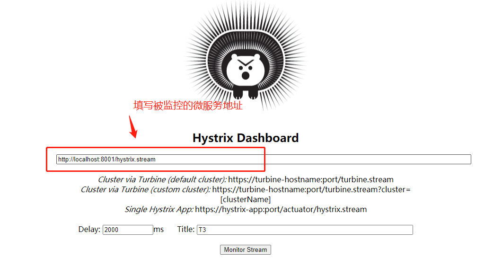
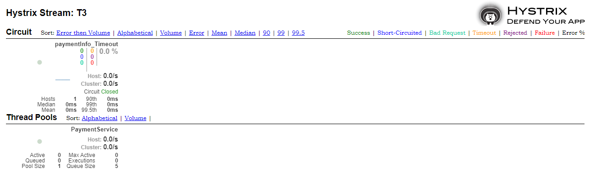

# Hystrix-Dashboard

## Dashboard简介

Hystrix提供了准实时的调用监控(Hystrix Dashboard)，Hystrix会持续地记录所有通过Hystrix发起的请求的执行信息，并以统计报表和图形的形式展示给用户，包括每秒执行多少请求，多少成功，多少失败等，Netflix通过hystrix-metrics-event-stream项目实现了对以上指标的监控。SpringCloud也提供了Hystrix Dashboard的整合，对监控内容转化成可视化界面。


## Dashboard搭建

### 添加依赖

```xml
<dependency>
    <groupId>org.springframework.cloud</groupId>
    <artifactId>spring-cloud-starter-netflix-hystrix-dashboard</artifactId>
</dependency>
```


### yml

```yml
server:
  port: 9001
```


### 在主启动类增加@EnableHystrixDashboard注解

```java
@SpringBootApplication
@EnableHystrixDashboard
public class HystrixDashboardMain9001 {

    public static void main(String[] args) {
        SpringApplication.run(HystrixDashboardMain9001.class, args);
    }
}
```


### 测试

在浏览器输入 http://localhost:9001/hystrix

出现下面页面表示成功：




## Dashboard使用

### 前提准备

一个被监控的微服务，这些被监控的微服务必须要增加下面依赖

```xml
<dependency>
    <groupId>org.springframework.boot</groupId>
    <artifactId>spring-boot-starter-actuator</artifactId>
</dependency>
```


### 填写监控地址




点击Monitor Stream按钮后出现下面界面，表示监控成功

