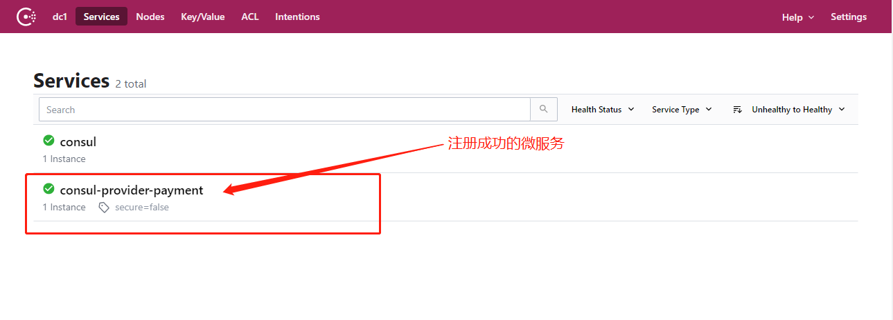

# 微服务注册进Consul

## 前提准备

1. 一个搭建好的微服务
2. 一个启动好的Consul


## 增加依赖

```xml
<dependency>
    <groupId>org.springframework.cloud</groupId>
    <artifactId>spring-cloud-starter-consul-discovery</artifactId>
</dependency>
```


## application.yml配置

```yml
server:
  port: 8006

spring:
  application:
    name: consul-provider-payment
  # consul注册中心地址
  cloud:
    consul:
      host: localhost
      port: 8500
      discovery:
        service-name: ${spring.application.name}
```


## 在主启动类增加`@EnableDiscoveryClient`注解

```java
@Slf4j
@EnableDiscoveryClient
@SpringBootApplication
public class PaymentMain8006 {

    public static void main(String[] args) {
        SpringApplication.run(PaymentMain8006.class, args);
    }
}
```


## 启动项目

在完成上面的配置之后，我们启动项目之后，该微服务就会注册到Consul中。

打开Consul图形管理界面 `http://localhost:8500/`

出现下面界面并展示微服务名称，表示注册成功

