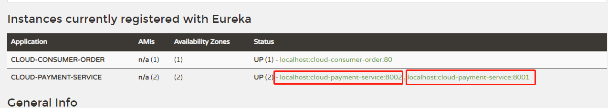
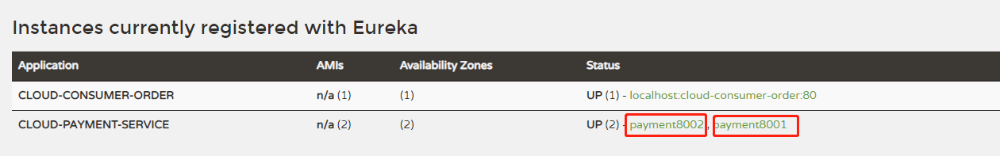
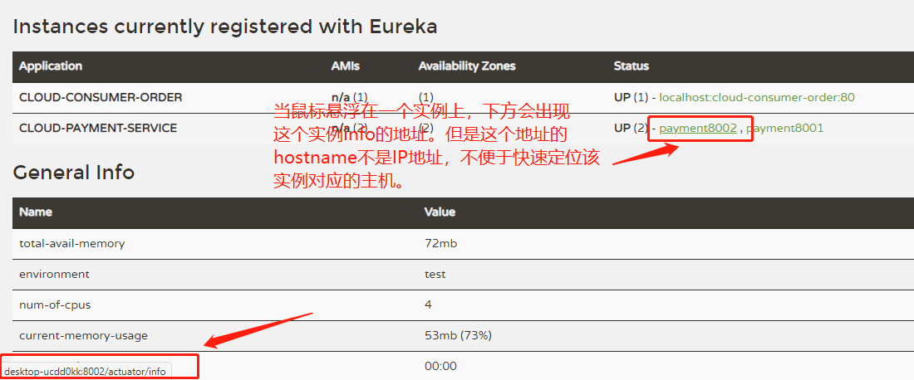
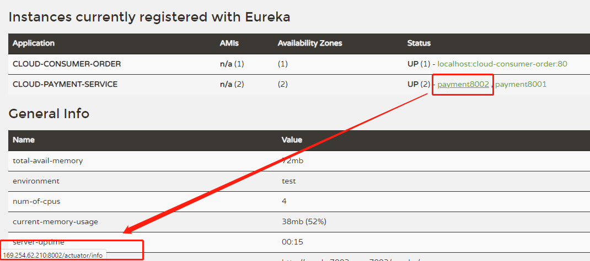

# Eureka Actuator配置

## 实例名配置

在Eureka配置页，我们可以看到默认的实例名是以`hostname + servicename + port`的方式命名的



我们可以自定义微服务的实例名

```yml
eureka:
  instance:
    instance-id: payment8001
```

配置完成之后的效果




## 显示实例IP信息提示

如图所示：



为了解决这个问题，我们可以开启实例IP信息提示

```yml
eureka:
  instance:
    instance-id: payment8001
    prefer-ip-address: true
```

配置完成之后，效果如下：



