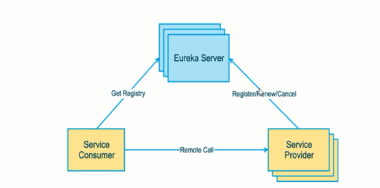

# Eureka基础知识

## 什么是服务治理

SpringCloud封装了Netflix公司开发的Eureka模块来实现**服务治理**。

在传统的rpc远程调用中，管理每个服务与服务之间依赖关系比较复杂，所以需要使用服务治理，来管理服务与服务之间依赖关系，可以实现服务调用、负载均衡、容错等，实现服务发现与注册。

## 什么是服务注册与发现

Eureka采用CS的设计架构。

Eureka Server作为服务注册的服务器，是服务注册中心。而系统中的其他微服务，使用Eureka的客户端连接到Eureka Server并维持心跳连接。这样系统的维护人员就可以通过Eureka Server来监控系统中各个微服务是否正常运行。

下图为Eureka系统架构：

## Eureka两个组件

Eureka包含两个组件：Eureka Server和Eureka Client

**Eureka Server**提供服务注册服务

各个微服务节点通过配置启动后，会在Eureka Server中进行注册，这样Eureka Server中的服务注册表将会存储所有可用服务节点的信息，服务节点的信息可以在界面中直观看到。

**Eureka Client**通过注册中心进行访问

Eureka Client是一个客户端，用于简化Eureka Server的交互。客户端同时也具备一个内置的、使用轮询(round-robin)负载算法的负载均衡器。在应用启动后，将会向Eureka Server发送心跳(默认周期为30秒)。如果Eureka Server在多个心跳周期内没有接受到某个节点的心跳，Eureka Server将会从服务注册表中把这个服务节点移除(默认为90秒)。