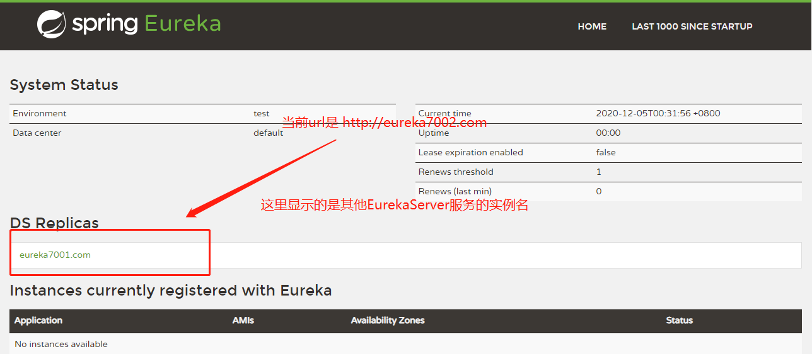

# Eureka集群环境构建

## EurekaServer集群搭建与配置

### 前置准备

1. 多个Eureka Server模块(EurekaServer的搭建可以参考**单机Eureka Server的搭建**)

2. 修改`C:\Windows\System32\drivers\etc\hosts`，在里面增加下述内容

   ```
   # Eureka配置
   127.0.0.1	eureka7001.com
   127.0.0.1	eureka7002.com
   ```

   > 这样配置的原因是模拟两台拥有不同ip地址的主机


### 集群配置

假设现在有两个EurekaServer，端口分别是7001和7002

EurekaServer-7001配置如下：

```yml
server:
  port: 7001

eureka:
  instance:
    hostname: eureka7001.com # eureka服务器的实例名称
  client:
    register-with-eureka: false # 表示不向注册中心注册自己
    fetch-registry: false # 表示当前端就是注册中心，我的职责就是维护服务实例，并不需要去检索服务
    service-url:
      # 设置与Eureka Server交互的地址，查询服务和注册服务都需要依赖这个地址
      defaultZone: http://eureka7002.com:7002/eureka/
```


EurekaServer-7002配置如下：

```yml
server:
  port: 7002

eureka:
  instance:
    hostname: eureka7002.com # eureka服务器的实例名称
  client:
    register-with-eureka: false # 表示不向注册中心注册自己
    fetch-registry: false # 表示当前端就是注册中心，我的职责就是维护服务实例，并不需要去检索服务
    service-url:
      # 设置与Eureka Server交互的地址，查询服务和注册服务都需要依赖这个地址
      defaultZone: http://eureka7001.com:7001/eureka/
```


### 测试是否配置成功

在浏览器输入`http://eureka7001.com:7001/eureka/`和`http://eureka7002.com:7002/eureka/`

出现下面页面表示成功：




### EurekaServer集群下，EurekaClient的配置

在EurekaServer集群下,EurekaClient的配置文件需要些许改变

```java
server:
  port: 80

spring:
  application:
    name: cloud-consumer-order

eureka:
  client:
    register-with-eureka: true
    fetch-registry: true
    service-url:
      # 变更的部分只有这里，就是EurekaServer地址的配置
      # defaultZone: http://localhost:7001/eureka
      defaultZone: http://eureka7001.com:7001/eureka,http://eureka7002.com:7002/eureka
```


## EurekaClient集群的搭建

### 前提准备

构建多个EurekaClient模块(EurekaClient的构建可以参考**单机EurekaClient的搭建**，但是defaultZone选项要修改为EurekaServer集群下的配置)

按上面的配置完成之后，多个EurekaClient启动之后，就会注册到EurekaServer中，并以`spring.application.name`配置的服务名统一对外提供服务。


### 不同模块之间的调用

在不同的模块中，SpringCloud使用RestTemplate来完成通信和交互。

在EurekClient集群下，相同服务名下可以有多个节点提供服务。

我们使用RestTemplate步骤如下：

1. 使用@LoadBalanced来为RestTemplate提供负载均衡的功能

   ```java
   @Bean
   @LoadBalanced
   public RestTemplate getRestTemplate() {
       return new RestTemplate();
   }
   ```

2. 不再使用固定的URL，而是使用服务名来调用其他模块

   ```java
   //public static final String PAYMENT_URL = "http://localhost:8081";
   public static final String PAYMENT_URL = "http://CLOUD-PAYMENT-SERVICE";
   ```

   


