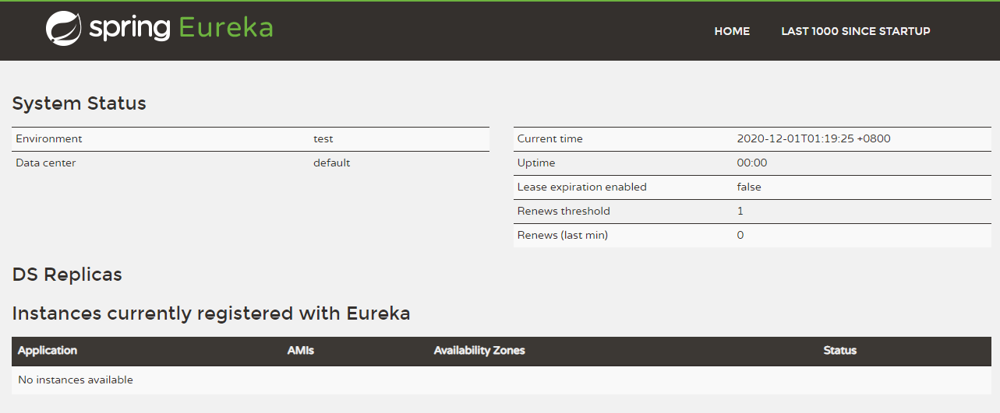
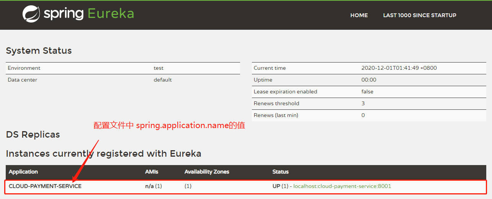

# 单机Eureka架构构建

## Eureka Server端服务注册中心

### 增加依赖

```xml
<dependency>
    <groupId>org.springframework.cloud</groupId>
    <artifactId>spring-cloud-starter-netflix-eureka-server</artifactId>
</dependency>
```


### application.yml配置

```yml
server:
  port: 7001

eureka:
  instance:
    hostname: localhost # eureka服务器的实例名称
  client:
    register-with-eureka: false # 表示不向注册中心注册自己
    fetch-registry: false # 表示当前端就是注册中心，我的职责就是维护服务实例，并不需要去检索服务
    service-url:
      # 设置与Eureka Server交互的地址，查询服务和注册服务都需要依赖这个地址
      defaultZone: http://${eureka.instance.hostname}:${server.port}/eureka/
```


### 在主启动类增加`@EnableEurekaServer`注解

```java
@EnableEurekaServer
@SpringBootApplication
public class EurekaMain7001 {

    public static void main(String[] args) {
        SpringApplication.run(EurekaMain7001.class, args);
    }
}
```


### 测试Eureka Server是否构建成功

在浏览器输入`http://localhost:7001`


出现下面页面，表示Eureka Server构建成功




## Eureka Client构建并注册到Eureka Server

### 增加依赖

```xml
<dependency>
    <groupId>org.springframework.cloud</groupId>
    <artifactId>spring-cloud-starter-netflix-eureka-client</artifactId>
</dependency>
```


### application.yml配置

```yml
server:
  port: 8001

spring:
  application:
    name: cloud-payment-service

eureka:
  client:
    register-with-eureka: true # 表示是否将自己注册进Eureka Server，默认为true
    # 是否从EurekaServer抓取已有的注册信息，默认为true。单节点无所谓，集群必须设置为true才能配合ribbon使用负载均衡
    fetch-registry: true
    service-url:
      defaultZone: http://localhost:7001/eureka
```


### 在主启动类增加`@EnableEurekaClient`注解

```java
@EnableEurekaClient
@SpringBootApplication
public class PaymenyMain8001 {

    public static void main(String[] args) {
        SpringApplication.run(PaymenyMain8001.class, args);
    }
}
```


### 测试Eureka Client是否注册到Eureka Server中

在浏览器输入`http://localhost:7001/`

