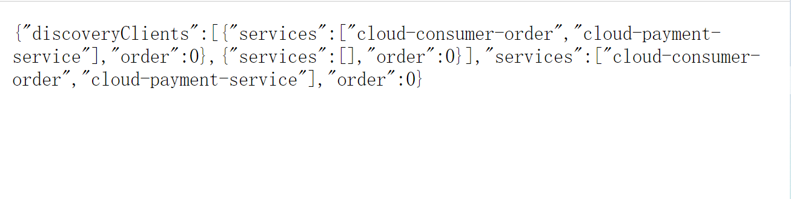

# 服务发现Discovery

## 什么是服务发现

对于注册进EurekaServer的微服务，可以通过服务发现来获得该服务的信息


## 服务发现的配置

1. 注入DiscoveryClient

   ```java
   @Slf4j
   @RestController
   public class PaymentController {
   
       @Autowired
       private DiscoveryClient discoveryClient;
   
   }
   ```

   

2. 配置discovery接口

   ```java
   @Slf4j
   @RestController
   public class PaymentController {
   
       @Autowired
       private DiscoveryClient discoveryClient;
   
       @GetMapping("/payment/discovery")
       public Object discovery() {
           //获取EurekaServer中注册了的所有服务名称，并log出来
           List<String> services = discoveryClient.getServices();
           for (String element : services) {
               log.info("element:" + element);
           }
   
           //获取当前服务的实例，并打印出来
           List<ServiceInstance> instances = discoveryClient.getInstances("CLOUD-PAYMENT-SERVICE");
           for (ServiceInstance instance : instances) {
               log.info(instance.getServiceId() + "/t" + instance.getHost() + "/t"
               + instance.getHost() + "/t" + instance.getPort() + "/t" + instance.getUri());
           }
   
           return this.discoveryClient;
       }
   
   }
   ```

   

3. 在主启动类配置@EnableDiscoveryClient注解

   

4. 打开网页`http://localhost:8001/payment/discovery`，就会出现下面的json串，里面就描述了当前注册到EurekaServer的微服务信息

   