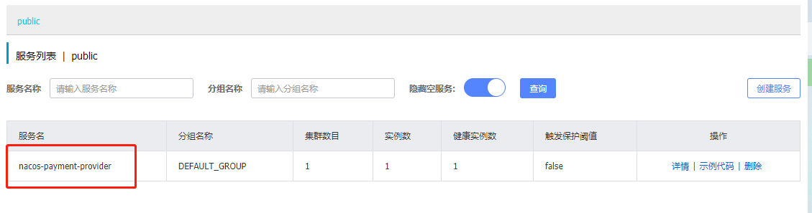

# nacos服务注册

## 依赖

```xml
<dependency>
    <groupId>com.alibaba.cloud</groupId>
    <artifactId>spring-cloud-starter-alibaba-nacos-discovery</artifactId>
</dependency>
```


## yml配置

```yml
server:
  port: 9001

spring:
  application:
    name: nacos-payment-provider
  cloud:
    nacos:
      discovery:
        server-addr: localhost:8848 #配置nacos地址

management:
  endpoints:
    web:
      exposure:
        include: '*'
```


## 测试

启动服务，打开nacos的服务管理 -> 服务列表，就可以看到注册了的服务




## 服务消费者构建

其实服务消费者和服务提供者的构建是一样的。

区别在于服务消费者需要获取服务提供者在注册中心的列表，所以我们需要在启动类加上`@EnableDiscoveryClient`

```java
@EnableDiscoveryClient
@SpringBootApplication
public class OrderNacosMain83 {

    public static void main(String[] args) {
        SpringApplication.run(OrderNacosMain83.class, args);
    }
}
```


### 负载

为了方便服务提供者的配置，在yml写下服务提供者的地址

```yml
# 消费者将要去访问的微服务名称(注册成功进nacos的微服务提供者)
service-url:
  nacos-user-service: http://nacos-payment-provider
```


之后就是调用其他微服务接口的业务编写，创建RestTemplate对象

```java
@Configuration
public class ApplicationContextConfig {

    @Bean
    @LoadBalanced
    public RestTemplate getRestTemplate() {
        return new RestTemplate();
    }
}
```

然后就是调用使用

```java
@RestController
@Slf4j
public class OrderNacosController {

    @Autowired
    private RestTemplate restTemplate;

    @Value("${service-url.nacos-user-service}")
    private String serverURL;

    @GetMapping(value = "/consumer/payment/nacos/{id}")
    public String paymentInfo(@PathVariable("id") Long id){
        return restTemplate.getForObject(serverURL + "/payment/nacos/" + id, String.class );
    }
}
```