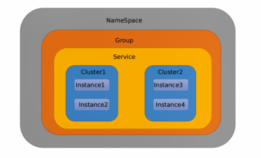

# nacos服务配置中心

## 服务配置使用

### 增加依赖

```xml
<dependency>
    <groupId>com.alibaba.cloud</groupId>
    <artifactId>spring-cloud-starter-alibaba-nacos-config</artifactId>
</dependency>
```


### yml配置

增加bootstrap.yml

```yml
#nacos配置
server:
  port: 3377

spring:
  application:
    name: nacos-config-client
  cloud:
    nacos:
      discovery:
        server-addr: localhost:8848
      config:
        server-addr: localhost:8848
        file-extension: yaml #指定yaml格式的配置
```


增加application.yml

```yml
spring:
  profiles:
    active: dev
```


### 业务类

```java
@RestController
@RefreshScope //支持nacos的动态刷新功能
public class ConfigClientController {

    @Value("${config.info}")
    private String configInfo;

    @GetMapping("/config/info")
    public String getConfigInfo() {
        return configInfo;
    }
}
```


### dataId命名规范

在Nacos Spring Cloud中，dataId的完整格式如下：

```
${prefix}-${spring.profile.active}.${file-extension}
```

- prefix默认为spring.application.name的值，也可以通过`spring.cloud.nacos.config.prefix`来配置
- spring.profile.active即为当前环境对应的profile。**注意**：当`spring.profile.active`为空时，对应的连接符`-`也将不存在，dataId的格式为`${prefix}.${file-extension}`
- file-extension为配置内容的数据格式，可以通过配置项`spring.cloud.nacos.config.fiile-extension`来配置。目前只支持yaml和properties类型。


### 在nacos增加服务配置

在nacos 配置管理的配置列表中，按照上面的**dataId命名规范**配置项目的配置。

然后服务启动后，就可以从nacos中获取到配置信息了。

而且nacos上的配置信息修改后，可以动态修改项目的依赖，而不需要重启。


## 概念

nacos存在namespace，group和service的概念。namespace是用于区分部署环境，group和dataId用于逻辑上区分两个对象。

三者关系如下：



默认情况下：

namespace = public， group=default_group，默认cluster是default。


group可以把不同的微服务划分到同一个分组里面去。

service就是微服务。一个微服务有多个集群cluster。

cluster是对指定微服务的一个虚拟划分。

比如说为了容灾，将service微服务分别部署在了杭州机房和广州机房。这是就可以给杭州机房的service微服务起一个集群名称(HZ)，给广州机房的service微服务起一个集群名称(GZ)，还可以尽量让同一个机房的微服务尽量调用，以提升性能。

最后是instance，就是微服务的实例。


## dataId切换

通过spring.profile.active指定的环境，可以使服务读取不同的环境下的配置。


## group切换

```yml
spring:
  application:
    name: nacos-config-client
  cloud:
    nacos:
      discovery:
        server-addr: localhost:8848
      config:
        server-addr: localhost:8848
        file-extension: yaml
        group: TEST_GROUP #指定想要读取的分组配置
```


## namespace切换

```yml
spring:
  application:
    name: nacos-config-client
  cloud:
    nacos:
      discovery:
        server-addr: localhost:8848
      config:
        server-addr: localhost:8848
        file-extension: yaml
        namespace: 6c132c7c-602c-4c97-bf8d-cef3bd6aa79b #指定命名空间id
```

