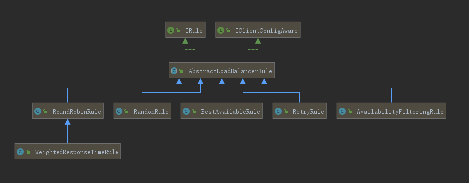

# Ribbon负载均衡算法

Ribbon有一个核心组件IRule，可以根据特定算法从服务列表中选取一个要访问的服务。


## IRule接口定义

```java
public interface IRule{

    public Server choose(Object key);
    
    public void setLoadBalancer(ILoadBalancer lb);
    
    public ILoadBalancer getLoadBalancer();    
}
```


## IRule接口实现类 



1. RoundRobinRule：轮询
2. RandomRule：随机
3. RetryRule：先按照RoundRobinRule的策略获取服务，如果获取服务失败则在指定时间内会进行重试，获取可用的服务
4. WeightedResponseTimeRule：对RoundRobinRule的扩展，响应速度越快的实例选择权重越大，越容易被选中
5. BestAvailableRule：会先过滤由于多次访问故障而处于断路器跳闸状态的服务，然后选择一个并发量最小的服务
6. AvailabilityFilteringRule：会先过滤掉故障实例，再选择并发小的实例
7. ZoneAvoidanceRule：默认规则，复合判断server所在区域的性能和server的可用性选择服务器


## 替换Ribbon默认的负载均衡算法

### 创建一个IRule实现类并注入进容器

```java
package com.xgc.myrule;

import com.netflix.loadbalancer.IRule;
import com.netflix.loadbalancer.RandomRule;
import org.springframework.context.annotation.Bean;
import org.springframework.context.annotation.Configuration;

@Configuration
public class MySelfRule {

    @Bean
    public IRule myRule() {
        return new RandomRule();
    }
    
}
```

> 这个自定义配置类不能放在@ComponentScan所扫描的当前包下以及子包下，否则我们自定义的这个配置类就会被所有的Ribbon客户端所共享，达不到特殊化定制的目的了。


### 主启动类添加`@RibbonClient`注解

```java
package com.xgc.cloud;

import com.xgc.myrule.MySelfRule;
import org.springframework.boot.SpringApplication;
import org.springframework.boot.autoconfigure.SpringBootApplication;
import org.springframework.cloud.netflix.eureka.EnableEurekaClient;
import org.springframework.cloud.netflix.ribbon.RibbonClient;
import org.springframework.cloud.netflix.ribbon.RibbonClients;

@RibbonClient(name = "CLOUD-PAYMENT-SERVICE", configuration = MySelfRule.class)
@EnableEurekaClient
@SpringBootApplication
public class OrderMain80 {

    public static void main(String[] args) {
        SpringApplication.run(OrderMain80.class, args);
    }
}
```

@RibbonClient注解的第一个参数指的是要获取的服务列表，第二个参数指的是我们要使用的负载均衡算法


### 测试

当我们调用接口的时候，接口把对应服务的端口返回回来。

通过多次调用同一个接口，通过返回的端口，我们就会发现Ribbon的负载均衡规则由原先的轮询变成了随机算法。


