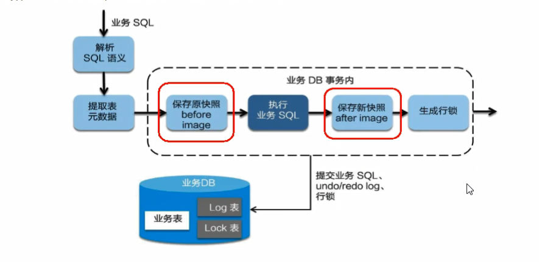
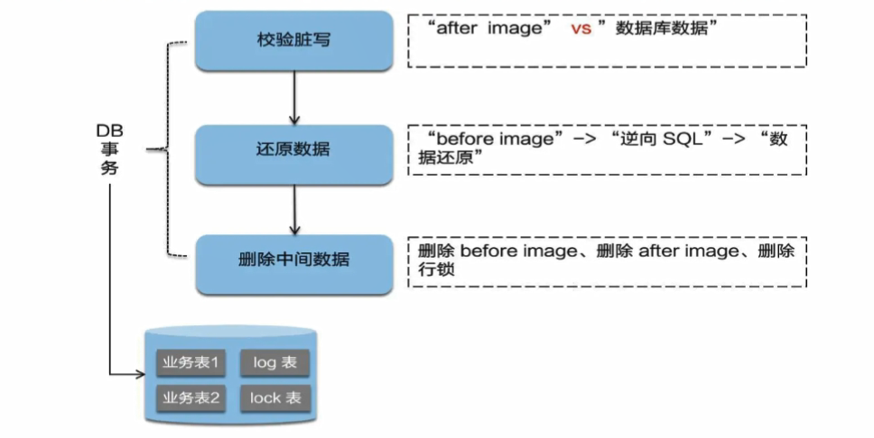

# Seata原理

## 分布式事务的执行流程

1. TM开启分布式事务(TM向TC注册全局事务记录)
2. 按业务场景，编排数据库、服务等事务内资源(RM向TC汇报资源准备状态)
3. TM结束分布式事务，事务一阶段结束(TM通知TC提交/回滚分布式事务)
4. TC汇总事务信息，决定分布式事务是提交还是回滚
5. TC通过所有RM提交/回滚资源，事务二阶段完成

## 模式

Seata支持AT模式、TCC模式、SAGA模式、XA模式四种事务模式。

默认使用AT模式。

### AT模式

#### 整体机制

两阶段提交：

- 一阶段：业务数据和回滚日志记录在同一个事务中提交，释放本地锁和连接资源
- 二阶段：
  - 提交异步化，非常快速的完成
  - 回滚通过一阶段的回滚日志进行反向补偿

#### 一阶段加载

在一阶段，Seata会拦截业务SQL

1. 解析SQL语义，找到业务SQL要更新的业务数据，在业务数据被更新前，将其保存为before iamge
2. 执行业务SQL更新业务数据，在业务更新之后
3. 将其保存为after image，最后生成行锁

以上操作全部在一个数据库事务完成，这样保证了一阶段操作的原子性

#### 二阶段提交

二阶段如果是顺利提交的话。

因为业务SQL在一阶段已经提交到数据库，所以Seata框架只需将**一阶段保存的快照数据和行锁删掉，完成数据清理即可。**

#### 二阶段回滚

二阶段如果是回滚的话，Seata就需要回滚一阶段已经执行的业务SQL，还原业务数据。

回滚方式就是用before image还原业务数据。但在还原之前首先要检验脏写，对比当前数据库业务数据和before image，如果两份数据完全一致就说明没有脏写，可以还原业务数据。否则，就有脏写，出现脏写就需要转人工处理。

