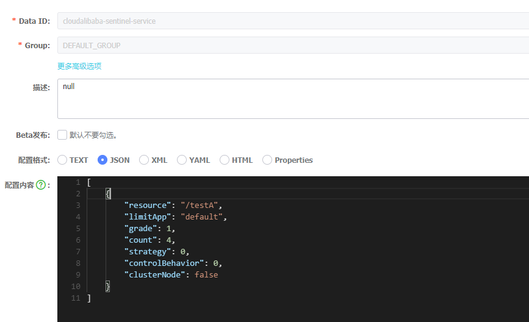

# Sentinel持久化

Sentinel默认的规则是临时的，微服务服务重启后就会消失。

为了完成持久化，我们要将限流规则持久化到nacos。


## 增加依赖

```xml
<dependency>
    <groupId>com.alibaba.csp</groupId>
    <artifactId>sentinel-datasource-nacos</artifactId>
</dependency>
```


## yml配置

```yml
spring:
  application:
    name: nacos-payment-provider
  cloud:
    nacos:
      discovery:
        server-addr: localhost:8848
    sentinel:
      transport:
        dashboard: localhost:8080
        port: 8719
      datasource:
        ds1:
          nacos:
            server-addr: localhost:8848
            dataId: cloudalibaba-sentinel-service
            groupId: DEFAULT_GROUP
            data-type: json
            rule-type: flow
```


## 在nacos配置



```json
[
    {
        "resource": "/testA",
        "limitApp": "default",
        "grade": 1,
        "count": 4,
        "strategy": 0,
        "controlBehavior": 0,
        "clusterNode": false
    }
]
```

- resource：资源名称
- limitApp：来源应用
- grade：阈值类型，0表示线程数，1表示QPS
- count：单机阈值
- strategy：流控模式，0表示直接，1表示关联，2表示链路
- controlBehavior：流控效果，0表示快速失败，1表示Warm Up，2表示排队等待
- clusterNode：是否集群


## 启动微服务

就可以看到流控规则了

