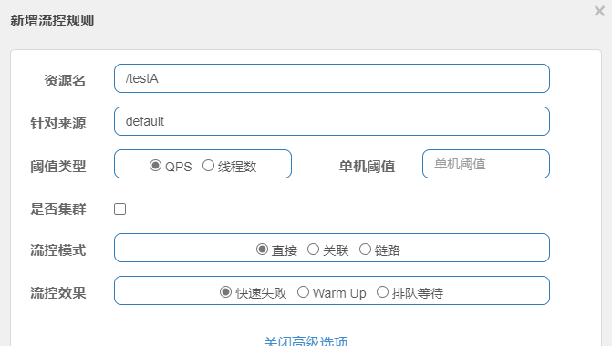
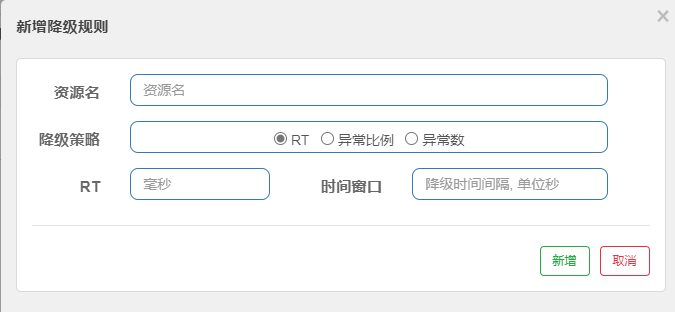
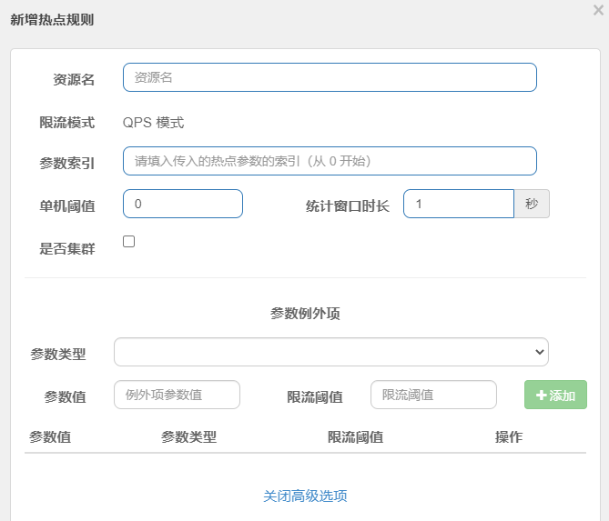
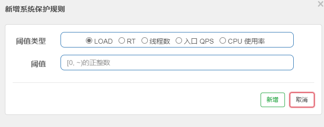

 # Sentinel监控配置

## 初始化监控

### 增加依赖

```xml
<dependency>
    <groupId>com.alibaba.cloud</groupId>
    <artifactId>spring-cloud-starter-alibaba-sentinel</artifactId>
</dependency>
```


### 配置

```yml
server:
  port: 8401

spring:
  application:
    name: cloudalibaba-sentinel-service
  cloud:
    nacos:
      discovery:
        #Nacos服务注册中心
        server-addr: localhost:8080
    sentinel:
      transport:
        dashboard: localhost:8080
        #默认8719端口，假设被占用就会+1，直到端口没被占用
        port: 8719

management:
  endpoint:
    web:
      exposure:
        include: '*'
```


## 流控规则




### 阈值类型

- QPS(每秒种的请求数量)：当调用该api的QPS达到阈值时，进行限流
- 线程数：当调用该api的线程数达到阈值的时候，进行限流


### 流控模式

- 直接：api达到限流条件时，直接限流
- 关联：当关联的资源达到阈值时，就限流自己
- 链路：只记录指定链路上的流量(指定资源从入口资源的流量，如果达到阈值，就进行限流)


### 流控效果

- 快速失败：直接失败，抛异常
- Warm up：根据codeFactor(冷加载因子，默认3)的值，从阈值/codeFactor，经过预热时长，才达到设置的QPS阈值。
- 排队等待：匀速排队


## 服务降级

Sentinel熔断降级会在调用链路中某个资源出现不稳定状态时，对这个资源的调用进行限制，让请求快速失败，避免影响到其他的资源而导致级联错误。

当资源被降级后，在接下来的降级时间窗口之内，对该资源的调用都自动熔断(默认行为是抛出DegradeException)

注：Sentinel的断路器是**没有半开状态**的。


### 降级规则




#### 降级策略

- RT(平均响应时间，秒级)

  平均响应时间超出阈值，且在时间窗口内通过的请求 >= 5，两个条件同时满足后触发降级。

  窗口期过后关闭断路器

  RT最大4900(更大的需要通过-Dcsp.sentinel.statistic.max.rt=XXXX才能生效)

- 异常比例(秒级)

  QPS>=5且异常比例(秒级统计)超出阈值时，触发降级。时间窗口结束后，关闭降级。

- 异常数(分钟级)

  异常数(分钟统计)超出阈值时，触发降级；时间窗口结束后，关闭降级。


## 热点规则




## 系统规则

- **Load 自适应**（仅对 Linux/Unix-like 机器生效）：系统的 load1 作为启发指标，进行自适应系统保护。当系统 load1 超过设定的启发值，且系统当前的并发线程数超过估算的系统容量时才会触发系统保护（BBR 阶段）。系统容量由系统的 `maxQps * minRt` 估算得出。设定参考值一般是 `CPU cores * 2.5`。
- **CPU usage**（1.5.0+ 版本）：当系统 CPU 使用率超过阈值即触发系统保护（取值范围 0.0-1.0），比较灵敏。
- **平均 RT**：当单台机器上所有入口流量的平均 RT 达到阈值即触发系统保护，单位是毫秒。
- **并发线程数**：当单台机器上所有入口流量的并发线程数达到阈值即触发系统保护。
- **入口 QPS**：当单台机器上所有入口流量的 QPS 达到阈值即触发系统保护。




## 限流降级方法

### 自定义限流降级方法

```java
@GetMapping("/testHostKey")
@SentinelResource(value = "testHostKey", blockHandler = "deal_testHotKey")
public String testHotKey(@RequestParam(value = "p1", required = false) String p1,
                         @RequestParam(value = "p2", required = false) String p2) {
    return "--------testHotKey";
}

public String deal_testHotKey(String p1, String p2, BlockException exception) {
    return "--------deal_testHotKey";
}
```


### 全局限流降级方法

```java
public class GlobalBlockHandler {

    //一定要静态
    public static String handlerException1 (BlockException blockException) {
        return "1";
    }

    public static String handlerException2 (BlockException blockException) {
        return "2";
    }
}
```

使用

```java
@GetMapping("/rateLimit/byUrl")
@SentinelResource(value = "byUrl",
                  blockHandlerClass = GlobalBlockHandler.class,
                  blockHandler = "handlerException1")
public String byUrl() {
    return "byUrl";
}
```


