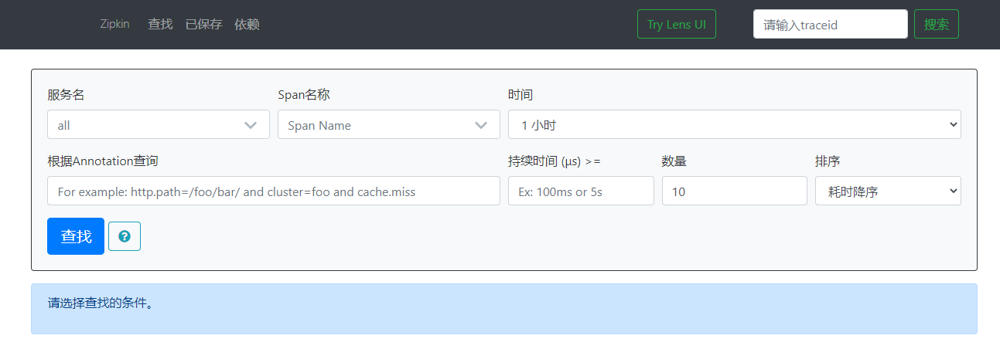

# 分布式链路追踪Sleuth简介

## 为什么需要分布式链路追踪

在微服务架构中，一个由客户端发送的请求，可能需要经过多个不同的服务节点来协同从而得到最后的结果。每一个前端请求都会形成一条复杂的分布式服务调用链路，调用链路上的任意一环出现错误或高延时都会导致整个请求的失败。

为了能够追踪请求的失败时在哪一环出错，于是就出现了分布式链路追踪。


## Zipkin安装

SpringCloud从F版开始就不需要自己安装Zipkin，运行jar包即可。

下载地址：https://dl.bintray.com/openzipkin/maven/io/zipkin/java/zipkin-server/

启动jar包之后，打开http://localhost:9411/zipkin/ 就会出现控制台




## zipkin使用

### 增加依赖

为所有微服务增加依赖

```xml
<!-- 包含了sleuth和zipkin -->
<dependency>
    <groupId>org.springframework.cloud</groupId>
    <artifactId>spring-cloud-starter-zipkin</artifactId>
</dependency>
```


### yml配置

```yml
spring:
  zipkin:
    # zipkin地址
    base-url: http://localhost:9411
  sleuth:
    sampler:
      #采样率值介于0到1之间，1表示全部采集
      probability: 1
```


### 测试

调用微服务之后，微服务之间的调用信息就会被记录，并在zipkin展示出来。