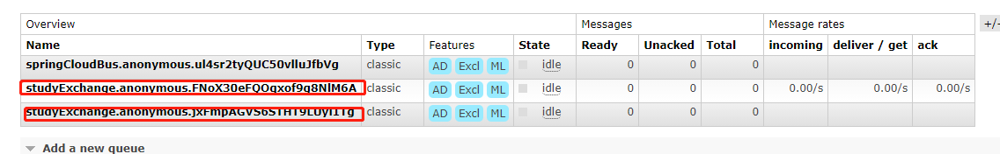

# 消息驱动stream使用

## 消息生产者构建

### 添加依赖

```xml
<dependency>
    <groupId>org.springframework.cloud</groupId>
    <artifactId>spring-cloud-starter-stream-rabbit</artifactId>
</dependency>
```


### yml配置

```yml
spring:
  application:
    name: cloud-stream-provider
  cloud:
    stream:
      binders: # 在此处配置要绑定的rabbitmq的服务信息；
        defaultRabbit: # 表示定义的名称，用于于binding整合
          type: rabbit # 消息组件类型
          environment: # 设置rabbitmq的相关的环境配置
            spring:
              rabbitmq:
                host: localhost
                port: 5672
                username: guest
                password: guest
      bindings: # 服务的整合处理
        output: # 这个名字是一个通道的名称
          destination: studyExchange # 表示要使用的Exchange名称定义
          content-type: application/json # 设置消息类型，本次为json，文本则设置“text/plain”
          binder: defaultRabbit # 设置要绑定的消息服务的具体设置
```


### 业务层编写

```java
public interface IMessageProvider {

    String send();
}
```

```java
@EnableBinding(Source.class) //定义消息的推送通道
public class MessageProviderImpl implements IMessageProvider {

    @Autowired
    private MessageChannel output; //消息发送管道

    @Override
    public String send() {
        String serial  = UUID.randomUUID().toString();
        output.send(MessageBuilder.withPayload(serial).build());
        System.out.println("*****serial:" + serial);
        return null;
    }
}
```


### 控制层编写

```java
@RestController
public class SendMessageController {

    @Autowired
    private IMessageProvider messageProvider;

    @GetMapping("/send")
    public String send() {
        return messageProvider.send();
    }
}
```


## 消息消费者构建

### 增加依赖

```xml
<dependency>
    <groupId>org.springframework.cloud</groupId>
    <artifactId>spring-cloud-starter-stream-rabbit</artifactId>
</dependency>
```


### yml配置

和生产者的区别值在于，消费者是input，生产者是output

```yml
server:
  port: 8802

spring:
  application:
    name: cloud-stream-consumer
  cloud:
    stream:
      binders: # 在此处配置要绑定的rabbitmq的服务信息；
        defaultRabbit: # 表示定义的名称，用于于binding整合
          type: rabbit # 消息组件类型
          environment: # 设置rabbitmq的相关的环境配置
            spring:
              rabbitmq:
                host: 123.57.159.15
                port: 5672
                username: xgc
                password: 123456
      bindings: # 服务的整合处理
        input: # 这个名字是一个通道的名称
          destination: studyExchange # 表示要使用的Exchange名称定义
          content-type: application/json # 设置消息类型，本次为json，文本则设置“text/plain”
          binder: defaultRabbit # 设置要绑定的消息服务的具体设置
```


### 业务编写

```java
@RestController
@EnableBinding(Sink.class)
public class ReceiveMessageListenerController {

    @Value("${server.port}")
    private String serverPort;

    @StreamListener(Sink.INPUT)
    public void input(Message<String> message) {
        System.out.println("消费者1号，接收到消息:" + message.getPayload() + "\t port:" + serverPort);
    }

}
```


### 测试

消息生产者和消息消费者启动之后，访问http://localhost:8801/send，可以看到控制台出现

```
消费者1号，接收到消息:dbdc775f-1c00-42c4-9b14-2c459af78714	 port:8802
```

表示stream使用成功


## 消息重复消费问题

假设我现在构建两个消息消费者，分别是8802和8803。

当消息生产者发送一次消息，两个消息消费者都会获取到数据并处理。

那么我们想发送的消息只被两个消费者中的一个消费，怎么处理？

这里提出一个叫做消费 组的概念。

打开http://123.57.159.15:15672/#/queues



上面红色圈出的就是两个组。

在同一组里面的两个消费者，只能有一个获取消息并处理。而不同组的两个消费者是可以都获取到消息的。


因此，解决重复消费的问题，只要把两个消费者归为一组就行。配置如下:

将该消费者分到groupA组。

```yml
spring:
  application:
    name: cloud-stream-consumer
  cloud:
    stream:
      binders: # 在此处配置要绑定的rabbitmq的服务信息；
        defaultRabbit: # 表示定义的名称，用于于binding整合
          type: rabbit # 消息组件类型
          environment: # 设置rabbitmq的相关的环境配置
            spring:
              rabbitmq:
                host: 123.57.159.15
                port: 5672
                username: xgc
                password: 123456
      bindings: # 服务的整合处理
        input: # 这个名字是一个通道的名称
          destination: studyExchange # 表示要使用的Exchange名称定义
          content-type: application/json # 设置消息类型，本次为json，文本则设置“text/plain”
          binder: defaultRabbit # 设置要绑定的消息服务的具体设置
          group: groupA
```


## 消息持久化

显式配置了分组属性的消费者，即便在消息生产者在发送消息时没有启动。在消息生产者发送消息之后才启动，也会收到消息。

而没有显式配置分组属性的消费者，在消息生产者发送消息后启动，则不会收到消息。

**因此，分组属性在消息持久化有着很重要的作用。**