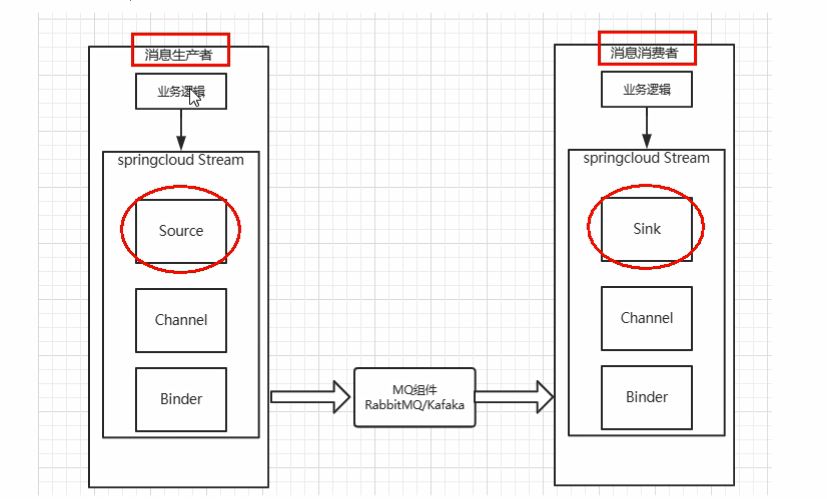
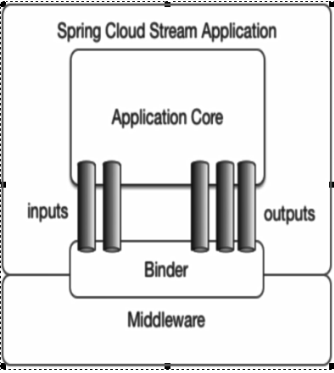

# 消息驱动stream简介

屏蔽底层消息中间件的差异，降低切换成本，统一消息的编程模型。

## 什么是SpringCloud Stream

官方定义SpringCloud Stream是一个构建消息驱动微服务的框架。

应用程序通过inputs或者outputs来与SpringCloud Stream中的binder对象交互。

我们通过配置就能binding(绑定)，而SpringCloud Stream的binder对象与消息中间件交互。

所以，我们只需要知道如何与SpringCloud Stream交互，就能够使用消息驱动的方式。

通过使用Spring Integration来连接消息代理中间件以实现消息事件驱动。

使用SpringCloud Stream来为一些提供商的消息中间件产品提供了个性化的自动化配置实现，引用了发布-订阅、消费组、分区的三个核心概念。

**目前只支持kafka和rabbitmq。**

## 为什么使用stream

比如说Kafka和RabbitMQ，这两个消息中间件架构不同。

像RabbitMQ有exchange，kafka有Topic和Partitions分区。

这些中间件的差异导致我们使用两个消息中间件的一种，后面需要切换成另一种消息中间件。一大堆东西都需要推到重做，因为耦合度很高。

SpringCloud Stream屏蔽底层差异，提供解耦合的方式

## 设计思想

### 标准MQ

- 生产者/消费者之间靠**消息**媒介传递消息内容

  Message

- 消息必须走特定的**通道**

  消息通道MessageChannel

- 消息通道里的消息如何被**消费**，谁负责收发**处理**

  消息通道MessageChannel的子接口SubscribableChannel，由MessageHandler消息处理器所订阅

### SpringCloud Stream如何统一底层差异

通过定义Binder作为中间件，实现应用程序和消息中间件细节的隔离。

Binder:

INPUT对应消费者

OUTPUT对应生产者

## SpringCloud Stream流程

- Binder：连接中间件，屏蔽差异
- Channel：通道，是队列Queue的一种抽象，在消息通讯系统中是实现存储和转发的媒介，通过Channel对队列进行配置
- Source和Sink：简单理解为参照对象是SpringCloud Stream自身，从Stream发布消息就是输出，接收消息就是输入

## 编程API和常用注解

| 组成            | 说明                                                         |
| --------------- | ------------------------------------------------------------ |
| Middleware      | 中间件，目前只支持RabbitMQ和Kafka                            |
| Binder          | Binder是应用与消息中间件之间的封装，目前实行了Kafka和RabbitMQ的Binder，通过Binder可以很方便的连接中间件，可以动态的改变消息类型(对应Kafka的topic，RabbitMQ的exchange)，这些都可以通过配置文件实现 |
| @Input          | 注解标识输入通道，通过该输入通道接受到的消息进入应用通道     |
| @Output         | 注解标识输出通道，发布的消息通过该通道离开应用程序           |
| @StreamListener | 监听队列，用于消费者的队列的消息接收                         |
| @EnableBinding  | 指信道channel与exchange绑定在一起                            |

