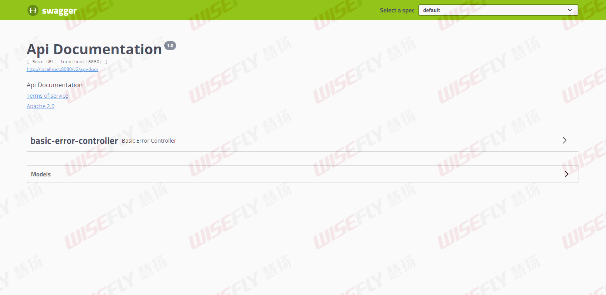
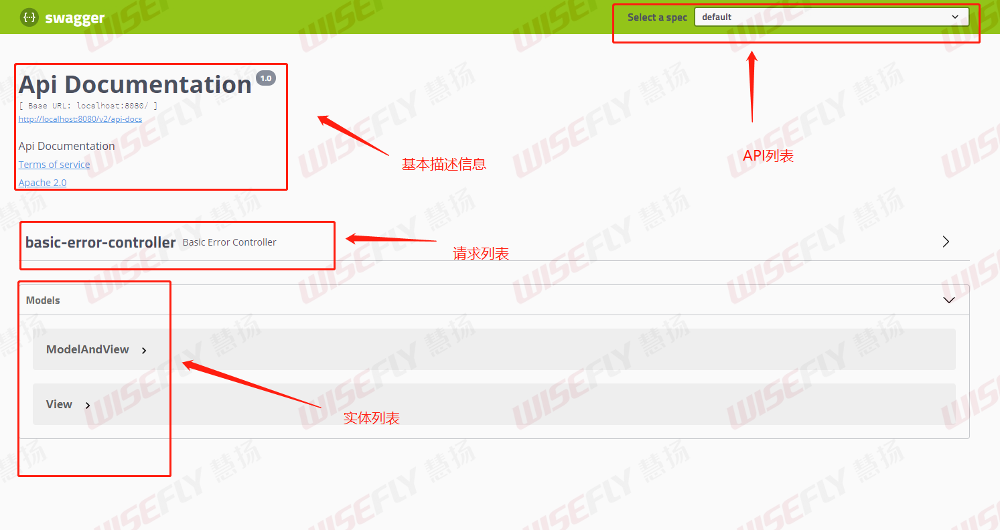
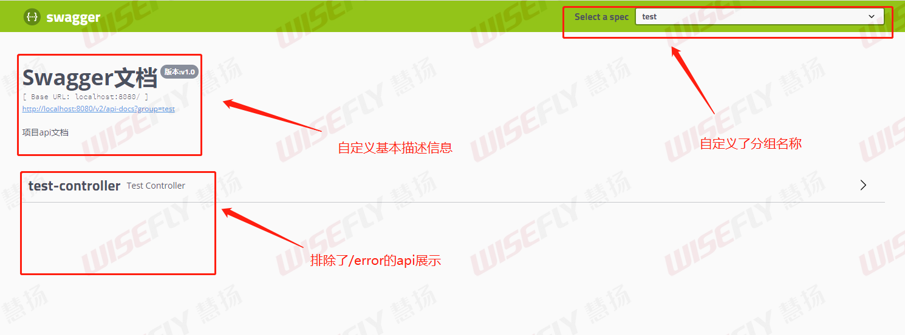

# SpringBoot整合Swagger2

## 初步整合Swagger2

### 导入依赖

在pom.xml文件加入Swgger2的依赖

```xml
<properties>
    <swagger.core.version>1.5.24</swagger.core.version>
    <swagger.fox.version>2.9.2</swagger.fox.version>
</properties>

<!-- Swagger -->
<dependency>
    <groupId>io.springfox</groupId>
    <artifactId>springfox-swagger2</artifactId>
    <version>${swagger.fox.version}</version>
</dependency>

<dependency>
    <groupId>io.springfox</groupId>
    <artifactId>springfox-swagger-ui</artifactId>
    <version>${swagger.fox.version}</version>
</dependency>
```


### 开启Swagger2的自动配置

在配置类上标注`@EnableSwagger2`注解

```java
@Configuration //说明这是一个配置类
@EnableSwagger2 //开启Swagger2的自动配置
public class SwaggerConfiguration {

}
```


### 查看SwaggerUi页面

在浏览器输入 `http://localhost:8080/swagger-ui.html#/`

出现下面页面就表示初步整合成功




## 自定义Swagger2

不管是SpringBoot整合还是SpringMVC整合Swagger都基本类似，重点在于配置。


### Swagger布局

我们先从下图看看Swagger的四部分布局：



第一部分：API分组。如果没有配置分组默认是default。通过Swagger实例Docket的`groupName`方法可以配置分组。

第二部分：基本描述。可以通过Swagger实例Docket的`apiInfo`方法中的ApiInfo实例参数配置文档信息

第三部分：请求接口列表。在组范围内，只要被Swagger2扫描匹配到的请求都会在这里出现

第四部分：实体列表。只要实体在请求接口的返回值上(即便是泛型)，都能映射到实体列表中


### 单个API分组的配置

在Swagger配置文件中，我们可以做更加细粒度的配置

```java
@Configuration //说明这是一个配置类
@EnableSwagger2 //开启Swagger2的自动配置
public class SwaggerConfiguration {

  @Bean
  public Docket init() {
    //构造参数传入初始化规范，这是Swagger2规范
    return new Docket(DocumentationType.SWAGGER_2)
        //配置apiInfo-基本描述信息
        .apiInfo(apiInfo())
        //配置组名
        .groupName("test")
        //默认是true，表示开启Swagger
        .enable(true)
        .select()
        //apis:添加过滤条件
        //设置组范围，即扫描需要展示的api的包
        .apis(RequestHandlerSelectors.basePackage("com.xgc.swagger.controller"))
        //排除 /error的api
        .paths(a -> !a.equals("/error"))
        .build();
  }

  //就是SwaggerUi第二部分-基本描述信息的内容配置
  private ApiInfo apiInfo() {
    return new ApiInfoBuilder()
        .title("Swagger文档")
        .description("项目api文档")
        .version("版本:v1.0")
        .build();
  }

}
```

这里做完配置之后，我们再来看看效果：




### 多个API分组的配置

很简单，配置多个分组只需要配置多个docket即可，代码如下：

```java
@Bean
public Docket docket1(){
   return new Docket(DocumentationType.SWAGGER_2)
      .groupName("组一")
      // 省略配置....
}
@Bean
public Docket docket2(){
   return new Docket(DocumentationType.SWAGGER_2)
     .groupName("组二")
     // 省略配置....
}
@Bean
public Docket docket3(){
   return new Docket(DocumentationType.SWAGGER_2)
     .groupName("组三")
     // 省略配置....
}
```


## Swagger自定义配置实例

上面的Swagger配置不全面，而且配置也是写死的。下面这个实例可以通过properties或yml文件动态对Swagger进行配置，而且也更加全面。


### SwaggerProperties

通过`@ConfigurationProperties`注解，可以实现配置文件中的配置可以与该类的实例对应起来，从而实现通过properties或yml文件动态对Swagger进行配置。

```java
@Data
@Component
@ConfigurationProperties("swagger")
public class SwaggerProperties {

  /**
   * 是否开启swagger
   */
  private Boolean enabled;

  /**
   * swagger会解析的包路径
   **/
  private String basePackage = "";

  /**
   * swagger会解析的url规则
   **/
  private List<String> basePath = new ArrayList<>();

  /**
   * 在basePath基础上需要排除的url规则
   **/
  private List<String> excludePath = new ArrayList<>();

  /**
   * 标题
   **/
  private String title = "";

  /**
   * 描述
   **/
  private String description = "";

  /**
   * 版本
   **/
  private String version = "";

  /**
   * 许可证
   **/
  private String license = "";

  /**
   * 许可证URL
   **/
  private String licenseUrl = "";

  /**
   * 服务条款URL
   **/
  private String termsOfServiceUrl = "";

  /**
   * host信息
   **/
  private String host = "";

  /**
   * 联系人信息
   */
  private Contact contact = new Contact();

  /**
   * 全局统一鉴权配置
   **/
  private Authorization authorization = new Authorization();

  @Data
  public static class Contact {

    /**
     * 联系人
     **/
    private String name = "";
    /**
     * 联系人url
     **/
    private String url = "";
    /**
     * 联系人email
     **/
    private String email = "";
  }

  @Data
  public static class Authorization {

    /**
     * 鉴权策略ID，需要和SecurityReferences ID保持一致
     */
    private String name = "";

    /**
     * 需要开启鉴权URL的正则
     */
    private String authRegex = "^.*$";

    /**
     * 鉴权作用域列表
     */
    private List<AuthorizationScope> authorizationScopeList = new ArrayList<>();

    private List<String> tokenUrlList = new ArrayList<>();
  }

  @Data
  public static class AuthorizationScope {

    /**
     * 作用域名称
     */
    private String scope = "";

    /**
     * 作用域描述
     */
    private String description = "";
  }
}
```


### SwaggerAutoConfiguration

```java
/**
 * Swagger配置类
 */
@EnableSwagger2
@ConditionalOnProperty(name = "swagger.enabled", matchIfMissing = true)
public class SwaggerAutoConfiguration {

  /**
   * 默认的排除路径，排除Spring Boot默认的错误处理路径和端点
   */
  private static final List<String> DEFAULT_EXCLUDE_PATH = Arrays.asList("/error", "/actuator/**");

  private static final String BASE_PATH = "/**";

  @Bean
  @ConditionalOnMissingBean
  public SwaggerProperties swaggerProperties() {
    return new SwaggerProperties();
  }

  @Bean
  //Swagger初始化配置
  public Docket api(SwaggerProperties swaggerProperties) {
    // base-path处理
    if (swaggerProperties.getBasePath().isEmpty()) {
      swaggerProperties.getBasePath().add(BASE_PATH);
    }
    // noinspection unchecked
    List<Predicate<String>> basePath = new ArrayList<Predicate<String>>();
    swaggerProperties.getBasePath().forEach(path -> basePath.add(PathSelectors.ant(path)));

    // exclude-path处理
    if (swaggerProperties.getExcludePath().isEmpty()) {
      swaggerProperties.getExcludePath().addAll(DEFAULT_EXCLUDE_PATH);
    }
    List<Predicate<String>> excludePath = new ArrayList<>();
    swaggerProperties.getExcludePath().forEach(path -> excludePath.add(PathSelectors.ant(path)));

    //noinspection Guava
    return new Docket(DocumentationType.SWAGGER_2)
        .host(swaggerProperties.getHost())
        //配置apiInfo-基本描述信息
        .apiInfo(apiInfo(swaggerProperties)).select()
        //设置组范围，即扫描需要展示的api的包
        .apis(RequestHandlerSelectors.basePackage(swaggerProperties.getBasePackage()))
        //设置要排除的api
        .paths(Predicates.and(Predicates.not(Predicates.or(excludePath)), Predicates.or(basePath)))
        .build()
        .securitySchemes(securitySchemes())
        .securityContexts(securityContexts())
        .pathMapping("/");
  }

  /**
   * 安全模式，这里指定token通过Authorization头请求头传递
   */
  private List<ApiKey> securitySchemes() {
    List<ApiKey> apiKeyList = new ArrayList<ApiKey>();
    apiKeyList.add(new ApiKey("Authorization", "Authorization", "header"));
    return apiKeyList;
  }

  /**
   * 安全上下文
   */
  private List<SecurityContext> securityContexts() {
    List<SecurityContext> securityContexts = new ArrayList<>();
    securityContexts.add(
        SecurityContext.builder()
            .securityReferences(defaultAuth())
        	//这里表示所有包含auth的接口不需要使用securitySchemes
            .forPaths(PathSelectors.regex("^(?!auth).*$"))
            .build());
    return securityContexts;
  }

  /**
   * 默认的全局鉴权策略
   *
   * @return
   */
  private List<SecurityReference> defaultAuth() {
    AuthorizationScope authorizationScope = new AuthorizationScope("global", "accessEverything");
    AuthorizationScope[] authorizationScopes = new AuthorizationScope[1];
    authorizationScopes[0] = authorizationScope;
    List<SecurityReference> securityReferences = new ArrayList<>();
    securityReferences.add(new SecurityReference("Authorization", authorizationScopes));
    return securityReferences;
  }

  private ApiInfo apiInfo(SwaggerProperties swaggerProperties) {
    return new ApiInfoBuilder()
        .title(swaggerProperties.getTitle())
        .description(swaggerProperties.getDescription())
        .license(swaggerProperties.getLicense())
        .licenseUrl(swaggerProperties.getLicenseUrl())
        .termsOfServiceUrl(swaggerProperties.getTermsOfServiceUrl())
        .contact(new Contact(swaggerProperties.getContact().getName(), swaggerProperties.getContact().getUrl(), swaggerProperties.getContact().getEmail()))
        .version(swaggerProperties.getVersion())
        .build();
  }
}
```


### EnableCustomSwagger2注解

自定义注解，想要使用自定义的Swagger功能，则在配置类上标注`@EnableCustomSwagger2`注解即可

```java
@Target({ElementType.TYPE})
@Retention(RetentionPolicy.RUNTIME)
@Documented
@Inherited
@Import({SwaggerAutoConfiguration.class})
public @interface EnableCustomSwagger2 {

}
```


## 参考文章

[SpringBoot整合Springfox-Swagger2](https://www.cnblogs.com/yichunguo/p/12665857.html)

