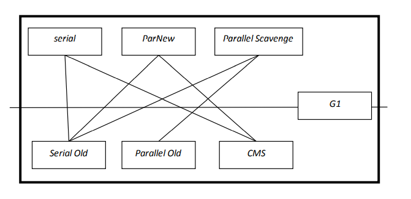

# JVM面试题

## Q1 GC发生在JVM哪部分，有几种GC，算法是什么？

**GC发生在堆中。**

**GC可以分为Minor GC和Full GC。**Minor GC收集新生代垃圾，Full GC收集老年代GC。

同时新生代有Serial收集器，ParNew(并行)收集器，Parallel Scavenge收集器。这三个使用的都是复制算法。

- Serial使用单线程完成GC工作，需要stop the world
- ParNew收集器是Serial收集器的多线程版本
- Parallel Scavenge收集器也是多线程完成GC工作，但是它更注重缩短每次stop the world的时间，提高系统的吞吐率

老年代有Serial Old收集器，Parallel Old收集器，CMS(Concurrent Mark Sweep)收集器

- Serial Old收集器是Serial收集器的老年代版本，使用Mark-Compact算法

- Parallel Old收集器是Parallel Scavenge收集器的老年代版本，使用Mark-Compact算法

- CMS收集器是真正意义上的并发收集器，以获得最短回收停顿时间为目标。使用Mark-Sweep算法

  1. 初始标记
  2. 并发标记
  3. 重新标记
  4. 标记清除

  其中初始标记和重新标记阶段需要stop the world。初始标记只标记一下GC Roots对象能直接关联的对象，速度很快。重新标记是为了修正并发标记阶段，因用户程序运行而导致标记发生变化的那一部分对象的标记记录，这阶段需要stop the world，但是远比并发标记的时间短。

另外，还有一个即可以收集新生代也可以收集老年代的G1收集器，它将堆分为一块块大小相等的Regin区。有新生代和老年代的概念，但是新生代和老年代不再物理隔离，它们是一部分Region的集合(不需要连续)。

**新生代GC和老年代GC的配合使用**

serial收集器：Serial Old收集器和CMS收集器

ParNew收集器：Serial Old收集器和CMS收集器

Parallel Scavenge收集器：Serial Old收集器和Parallel Old收集器

**算法：(4种)**

- 引用计数法

  对对象的引用进行计数。但不能解决循环引用问题。

- 复制算法

  遍历From区域找到存活对象，拷贝到To中。然后From、To交换身份，下次内存分配在先前的To区开始。缺点是需要双倍空间。

- 标记清除(Mark-Sweep)

  第一阶段，从根节点开始扫描，标记存活的对象

  第二阶段，扫描整个堆，清除未标记的对象

  这个算法需要stop the world，同时也会产生碎片

- 标记压缩(Mark-Compact)

  第一阶段，从根节点开始扫描，标记存活的对象

  第二阶段，扫描整个堆，清除未标记的对象，并把存活的对象压缩到堆的一块，从而避免碎片

  这个算法避免了标记清除算法的内存碎片问题，也避免了复制算法的双倍内存空间问题。

