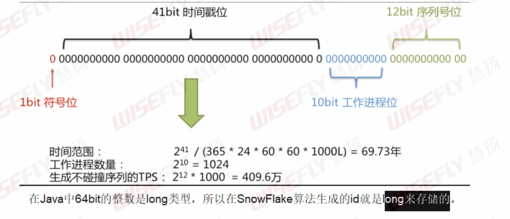

# SpringCloud面试题

## Q1 集群高并发情况下如何保证分布式唯一全局id生成

### 分布式id生成要求

**ID生成规则部分硬性要求：**

1. 全局唯一

2. 趋势递增

   在MySQL的InnoDB引擎中使用的是聚集索引。由于大多数RDBMS使用BTREE来存储索引数据，所以主键有序会保证写入性能。

3. 单调递增

   保证下一个id大于上一个id，例如事务版本号，IM增量消息，排序等特殊需求

4. 信息安全

   如果id有序，恶意用户爬取工作就很简单，按顺序下载执行URL即可。如果是订单号，竞争对手就可以知道我们一天的单量。

   所以在一些应用场景下，需要id无规则。

5. 含时间戳

   能够标识这个分布式id的生成时间

**ID生成系统的可用性要求：**

1. 高可用

   发一个获取分布式ID的请求，服务器能够尽量保证创建成功

2. 低延迟

   发一个获取分布式ID的请求，获取速度快

3. 高QPS

   能够承受住高并发

### 以前过时方案

#### UUID

UUID(Universally Unique Identifier)的标准型式包含32个16进制数字，以连字号分为五段，形式为`8-4-4-4-12`的36个字符。

性能非常高，本地生成，没有网络消耗

但是**入数据库性能变差**

1. 无序，不递增

2. 过长，不适合做主键

3. 会导致B+索引分裂

   UUID无序，每次插入都会对主键唯一索引进行很大的修改。而且还会导致一些中间节点产生分裂，也会白白创造出很多不饱和的节点，大大降低了数据库插入的性能。

#### 数据库自增主键

在单机模式里，数据库的自增ID机制的主要原理是：数据库自增ID和mysql数据库的replace into实现的。

在分布式模式下，设置数据库的自增步长实现。但是系统的水平扩展比较困难。

而且每次获取ID都得读写一次数据库，影响性能。

#### 基于Redis生成全局id策略

因为Redis是单线程的，天生是原子性。可以使用原子操作INCR和INCRNY来实现。

分布式下

在Redis集群下，同样要设置自增步长，同时key要设置有效期。

但水平扩展难，而且需要维护Redis集群。

### 雪花算法

Twitter的分布式自增ID算法snowflake，经测试每秒能够产生26万个自增可排序的ID。

1. 雪花算法能够按照时间有序生成
2. 雪花算法生成id是一个64bit大小的整数，为一个Long型(转换成字符串后长度最多19)

#### 结构

解析：

- **符号位**：1bit

  始终为0。二进制中最高位是符号位，1表示负数，0表示整数。

- **时间戳位**：41bit

  可以用69.73年。1970年-2039年。

- **工作进程位**：10bit，用于记录工作机器id

  可以部署在1024个结点，包括5位datacenterId和5位workerId。

  理论上是32个机房，每个机房可以有32台机器。

- **序列号位**：12bit，用于记录同毫秒内产生的不同id

  同一机器同一时间戳(毫秒)可以产生4095个ID序号。

#### 优缺点

**优点：**

- 毫秒数在高位，自增序列在低位，整个id是 趋势递增
- 生成ID性能高
- 可以根据自身业务分配bit位，非常灵活

**缺点：**

- 依赖机器时钟。如果机器时钟回拨，会导致ID重复