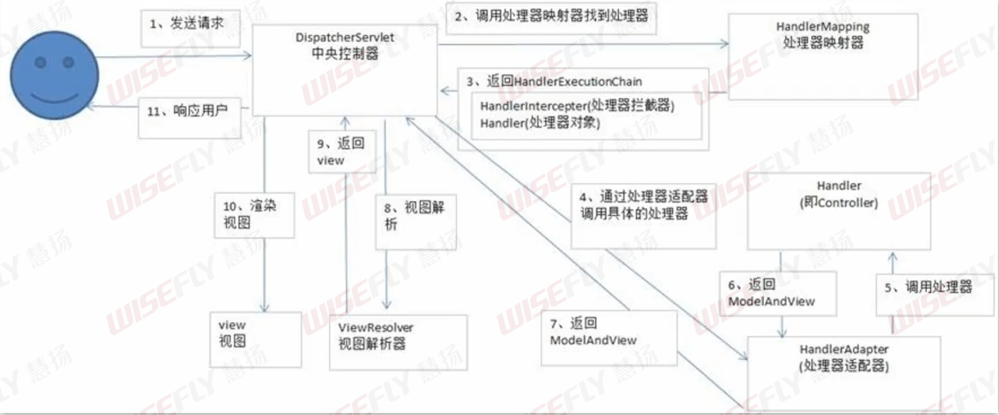

# SpringMvc面试题

## Q1 如何解决POST请求中文乱码问题

在web.xml中配置过滤器，设置字符编码为utf-8

```xml
<filter>
	<filter-name>CharacterEncodingFilter</filter-name>
    <filter-class>org.springframework.web.filter.CharacterEncodingFilter</filter-class>
    <init-param>
    	<param-name>encoding</param-name>
        <param-value>utf-8</param-value>
    </init-param>
    <init-param>
    	<param-name>forceEncoding</param-name>
        <param-value>true</param-value>
    </init-param>
</filter>
<filter-mapping>
	<filter-name>CharacterEncodingFilter</filter-name>
    <url-pattern>/*<url-pattern>
</filter-mapping>
```


## Q2 SpringMvc的工作流程



1. DispatcherServlet(中央控制器)接受到用户的请求后，调用HandlerMapping(处理器映射器)获得HandlerExecutionChain(里面包含了Handler-处理器对象、HandlerInterceptor-处理器拦截器)。
2. DispatcherServlet通过HandlerAdapter(处理器适配器)调用具体的处理器，并获得ModelAndView对象
3. DispatcherServlet获得ModelAndView对象之后，调用ViewResolver(视图解析器)获得view。
4. 渲染视图并返回给用户


